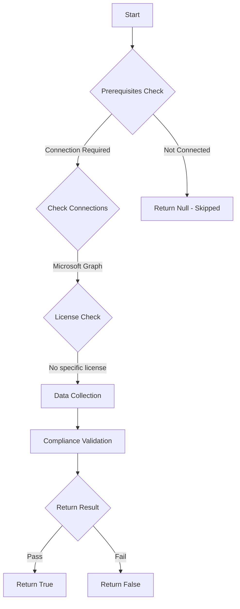

# Test-MtExoMoeraMailActivity: Checks the sent mail activity for MOERA addresses in the past 7 days.

## Overview

**Function Name:** `Test-MtExoMoeraMailActivity`
**Category:** Maester/Exchange

## Description

This command retrieves the mail activity for the past 7 days, and checks
        for any sent mail from MOERA addresses.

## Workflow

## Phase Details

### Phase 1: Prerequisites Check

**Required Connections:**
- Microsoft Graph

### Phase 2: Data Collection

**Cmdlets/Functions Used:**
- `Get-Date`
- `Invoke-MgGraphRequest`

### Phase 3: Compliance Validation

The function validates the collected data against compliance requirements.

### Phase 4: Return Result

| Return Value | Meaning |
| --- | --- |
| `$true` | Compliant |
| `$false` | Non-Compliant |
| `$null` | Skipped (missing prerequisites, license, or error) |

## Original Documentation

Microsoft Online Exchange Routing Addresses (MOERA) SHOULD NOT be used for sent mail.

#### Remediation action:

For each listed user principal name, update primary SMTP address to use a [registered domain](https://entra.microsoft.com/#view/Microsoft_AAD_IAM/DomainsManagementMenuBlade/~/CustomDomainNames).

> If the listed user principal name sends mail from a script or application, you may need to update that configuration as well.

##### Entra Managed Mail Attributes

1. Within the Entra Portal, navigate to [All users](https://entra.microsoft.com/#view/Microsoft_AAD_UsersAndTenants/UserManagementMenuBlade/~/AllUsers/menuId/)

2. Select the user

3. Select Edit properties

4. Select Contact information

5. Update the Email attribute

6. Select Save

##### AD Managed Mail Attributes

Processes can vary depending on use of PowerShell, AD MMCs, or Exchange Management Portal. Update according to your internal processes.

#### Related links

* [Limiting Onmicrosoft Domain Usage for Sending Emails](https://techcommunity.microsoft.com/blog/exchange/limiting-onmicrosoft-domain-usage-for-sending-emails/4446167)

<!--- Results --->
%TestResult%

## Standalone Function

See the standalone compliance check function: [`Test-MtExoMoeraMailActivityCompliance.ps1`](../../standalone-functions/Maester/Exchange/Test-MtExoMoeraMailActivityCompliance.ps1)
