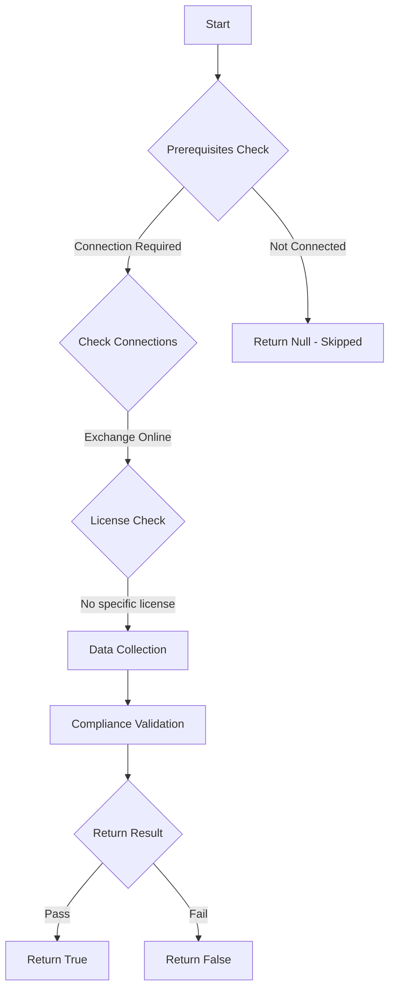

# Test-MtExoOutlookAddin: Checks if users installing Outlook add-ins is not allowed

## Overview

**Function Name:** `Test-MtExoOutlookAddin`
**Category:** Maester/Exchange

## Description

This command checks if users are able to install add-ins for Outlook in Exchange Online.
    By default, users can install add-ins in their Microsoft Outlook Desktop client, allowing data
    access within the client application. Attackers exploit vulnerable or custom add-ins to access user data.

## Workflow



## Phase Details

### Phase 1: Prerequisites Check

**Required Connections:**
- Exchange Online

### Phase 2: Data Collection

**Exchange Online Requests:**
- `ManagementRoleAssignment`
- `RoleAssignmentPolicy`

### Phase 3: Compliance Validation

**Properties Checked:**

| Property | Expected Value |
| --- | --- |
| `Identity` | `Default` |
| `Role` | `My` |
| `RoleAssigneeName` | `$roleAssignmentPolicyDefault.Name` |

### Phase 4: Return Result

| Return Value | Meaning |
| --- | --- |
| `$true` | Compliant |
| `$false` | Non-Compliant |
| `$null` | Skipped (missing prerequisites, license, or error) |

## Original Documentation

Users SHOULD NOT be allowed to install Outlook add-ins

Rationale: When users can install their own Outlook add-ins, it creates security risks. Malicious add-ins could access email content, exploit vulnerabilities, or facilitate data exfiltration through legitimate-looking add-ins.

#### Remediation action:

1. Connect to Exchange Online:
```powershell
Connect-ExchangeOnline
```

2. Get the current role assignment policy:
```powershell
Get-RoleAssignmentPolicy | Where-Object { $_.IsDefault }
```

3. Check which app-related roles are assigned:
```powershell
Get-ManagementRoleAssignment -RoleAssignee "Default Role Assignment Policy" | Where-Object { $_.Role -like "My*Apps" }
```

4. Remove the app installation permissions from the default policy:
```powershell
Get-ManagementRoleAssignment -RoleAssignee "Default Role Assignment Policy" | Where-Object { $_.Role -like "My*Apps" } | Remove-ManagementRoleAssignment -Confirm:$false
```

5. Verify the changes:
```powershell
Get-ManagementRoleAssignment -RoleAssignee "Default Role Assignment Policy" | Where-Object { $_.Role -like "My*Apps" }
```
The result should return no assignments.

#### Related links

* [Role-based access control in Exchange Online](https://learn.microsoft.com/en-us/exchange/permissions-exo/permissions-exo)
* [CIS Microsoft 365 Benchmark - 1.3.4 (L1) Ensure 'User owned apps and services' is restricted](https://www.cisecurity.org/benchmark/microsoft_365)
* [Microsoft Secure Score - Restrict user consent to applications](https://security.microsoft.com/securescore)

<!--- Results --->
%TestResult%

## Standalone Function

See the standalone compliance check function: [`Test-MtExoOutlookAddinCompliance.ps1`](../../standalone-functions/Maester/Exchange/Test-MtExoOutlookAddinCompliance.ps1)
