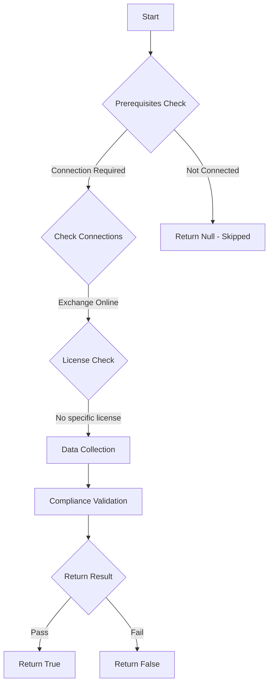

# Test-MtExoRejectDirectSend: Checks if direct send is configured to reject

## Overview

**Function Name:** `Test-MtExoRejectDirectSend`
**Category:** Maester/Exchange

## Description

Attackers can exploit direct send to send spam or phishing emails without authentication.
    Direct Send covers anonymous messages (unauthenticated messages) sent from your own domain
    to your organization's mailboxes using the tenant MX

## Workflow



## Phase Details

### Phase 1: Prerequisites Check

**Required Connections:**
- Exchange Online

### Phase 2: Data Collection

**Exchange Online Requests:**
- `OrganizationConfig`

### Phase 3: Compliance Validation

The function validates the collected data against compliance requirements.

### Phase 4: Return Result

| Return Value | Meaning |
| --- | --- |
| `$true` | Compliant |
| `$false` | Non-Compliant |
| `$null` | Skipped (missing prerequisites, license, or error) |

## Original Documentation

Direct Send SHOULD be configured to `Reject` in Exchange Online

Rationale: Attackers can exploit direct send to send spam or phishing emails without authentication. Direct Send covers anonymous messages (unauthenticated messages) sent from your own domain to your organization's mailboxes using the tenant MX.

#### Remediation action:

1. Connect to Exchange Online:
```powershell
Connect-ExchangeOnline
```

2. Configure the setting to reject direct send:
```powershell
Set-OrganizationConfig -RejectDirectSend $true
```

3. Verify the policy:
```powershell
(Get-OrganizationConfig).RejectDirectSend
```
The result should be `True`.

#### Related links

* [Introducing more control over Direct Send in Exchange Online](https://techcommunity.microsoft.com/blog/exchange/introducing-more-control-over-direct-send-in-exchange-online/4408790)
* [Direct Send: Send mail directly from your device or application to Microsoft 365](https://learn.microsoft.com/en-us/exchange/mail-flow-best-practices/how-to-set-up-a-multifunction-device-or-application-to-send-email-using-microsoft-365-or-office-365#direct-send-send-mail-directly-from-your-device-or-application-to-microsoft-365-or-office-365)

<!--- Results --->
%TestResult%

## Standalone Function

See the standalone compliance check function: [`Test-MtExoRejectDirectSendCompliance.ps1`](../../standalone-functions/Maester/Exchange/Test-MtExoRejectDirectSendCompliance.ps1)
