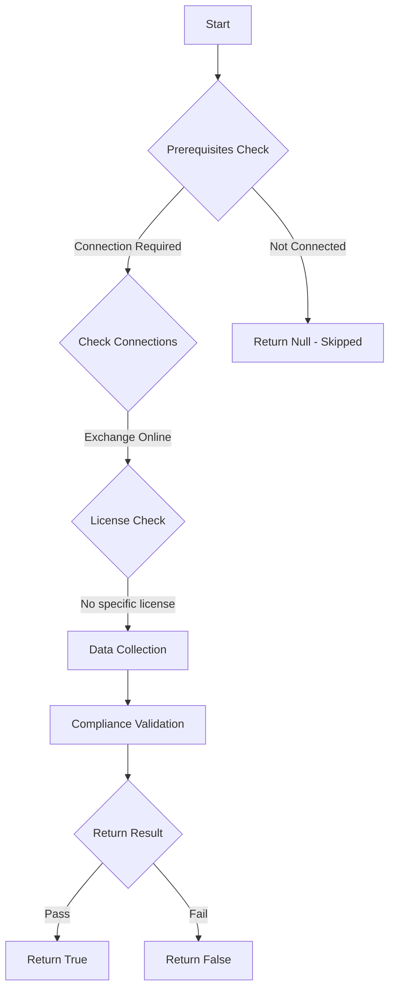

# Test-MtExoSetScl: Checks if Spam confidence level (SCL) is configured in mail transport rules with specific domains

## Overview

**Function Name:** `Test-MtExoSetScl`
**Category:** Maester/Exchange

## Description

This command checks if Spam confidence level (SCL) is properly configured in mail transport rules.
    Allow-listing domains in transport rules bypasses regular malware and phishing scanning, which can
    enable an attacker to launch attacks against your users from a safe haven domain.

## Workflow



## Phase Details

### Phase 1: Prerequisites Check

**Required Connections:**
- Exchange Online

### Phase 2: Data Collection

**Exchange Online Requests:**
- `TransportRule`

### Phase 3: Compliance Validation

**Properties Checked:**

| Property | Expected Value |
| --- | --- |
| `SetScl` | `-1` |

### Phase 4: Return Result

| Return Value | Meaning |
| --- | --- |
| `$true` | Compliant |
| `$false` | Non-Compliant |
| `$null` | Skipped (missing prerequisites, license, or error) |

## Original Documentation

Spam confidence level (SCL) SHOULD NOT be set to -1 in mail transport rules with specific domains

Rationale: Allow-listing domains in transport rules bypasses regular malware and phishing scanning, which can enable an attacker to launch attacks against your users from a safe haven domain.

#### Remediation action:

1. Connect to Exchange Online:
```powershell
Connect-ExchangeOnline
```

2. View your current transport rules:
```powershell
Get-TransportRule | Select-Object Name, SetScl
```

3. For each transport rule that uses `SetScl -1`, modify it to set SCL to 0 or higher:
```powershell
Set-TransportRule -Identity "RuleName" -SetSCL 0
```

4. Verify the changes:
```powershell
Get-TransportRule | Where-Object { $_.SetScl -eq -1 }
```
The result should return no rules.

#### Related links

* [Exchange Transport Rules and SCL values](https://learn.microsoft.com/en-us/exchange/security-and-compliance/mail-flow-rules/mail-flow-rules)
* [Spam Confidence Levels (SCL) in Exchange Online](https://learn.microsoft.com/en-us/microsoft-365/security/office-365-security/anti-spam-message-headers)
* [Microsoft Secure Score - Set SCL to 0 or higher for domains](https://security.microsoft.com/securescore)

<!--- Results --->
%TestResult%

## Standalone Function

See the standalone compliance check function: [`Test-MtExoSetSclCompliance.ps1`](../../standalone-functions/Maester/Exchange/Test-MtExoSetSclCompliance.ps1)
