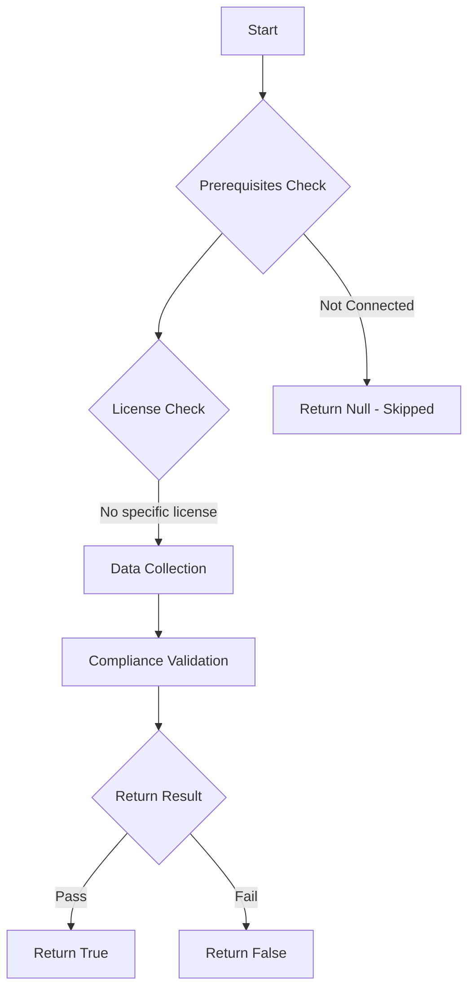

# Test-MtAndroidEnterpriseConnection: Check the health of the Android Enterprise connection for Intune.

## Overview

**Function Name:** `Test-MtAndroidEnterpriseConnection`
**Category:** Maester/Intune

## Description

The Android Enterprise connection is required to synchronize Android enterprise apps and allow Android enrollment with Microsoft Intune. This command checks if the connection is valid and not expired.

## Workflow

## Phase Details

### Phase 1: Prerequisites Check

No specific prerequisites required.

### Phase 2: Data Collection

**Graph API Calls:**
- `deviceManagement/androidManagedStoreAccountEnterpriseSettings`

**Cmdlets/Functions Used:**
- `Invoke-MtGraphRequest`

### Phase 3: Compliance Validation

The function validates the collected data against compliance requirements.

### Phase 4: Return Result

| Return Value | Meaning |
| --- | --- |
| `$true` | Compliant |
| `$false` | Non-Compliant |
| `$null` | Skipped (missing prerequisites, license, or error) |

## Original Documentation

This test checks if the Android Enterprise account connection is valid and has recently synchronized. The Android Enterprise connection is required to synchronize Android enterprise apps and allow device enrollment with Microsoft Intune.

#### Remediation action

The following Microsoft Learn article describes how to [Connect your Intune account to your managed Google Play account](https://learn.microsoft.com/en-us/intune/intune-service/enrollment/connect-intune-android-enterprise).

Additional links:

* [Intune - Managed Google Play Sync Blade](https://intune.microsoft.com/#view/Microsoft_Intune_Apps/ManagedGooglePlaySyncBlade)
* [Google - Organize managed Google Play accounts enterprises](https://support.google.com/googleplay/work/answer/7042126?hl=en&sjid=2119181478110152135-EU)

<!--- Results --->
%TestResult%

## Standalone Function

See the standalone compliance check function: [`Test-MtAndroidEnterpriseConnectionCompliance.ps1`](../../standalone-functions/Maester/Intune/Test-MtAndroidEnterpriseConnectionCompliance.ps1)
