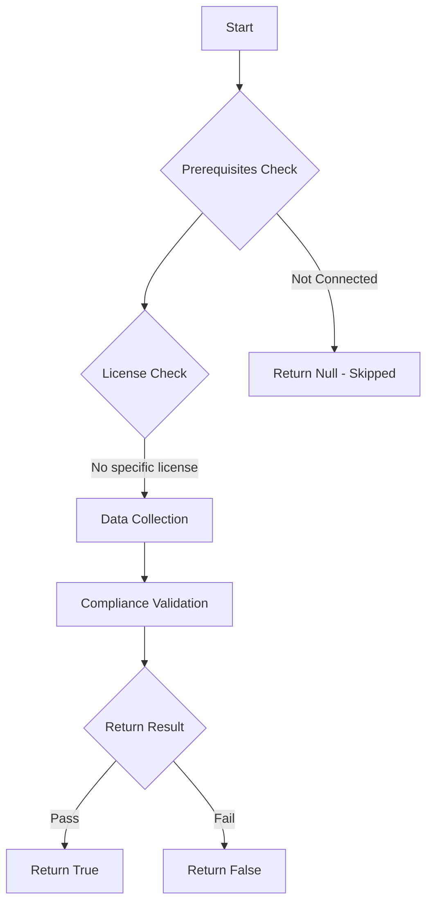

# Test-MtAppleAutomatedDeviceEnrollmentToken: Check the validity of the Apple Automated Device Enrollment (ADE) token for Intune.

## Overview

**Function Name:** `Test-MtAppleAutomatedDeviceEnrollmentToken`
**Category:** Maester/Intune

## Description

The Apple Automated Device Enrollment (ADE) token is required to synchronize Apple devices with Microsoft Intune. This command checks if the ADE token is valid and not expired.

## Workflow

## Phase Details

### Phase 1: Prerequisites Check

No specific prerequisites required.

### Phase 2: Data Collection

**Graph API Calls:**
- `deviceManagement/depOnboardingSettings`

**Cmdlets/Functions Used:**
- `Invoke-MtGraphRequest`

### Phase 3: Compliance Validation

The function validates the collected data against compliance requirements.

### Phase 4: Return Result

| Return Value | Meaning |
| --- | --- |
| `$true` | Compliant |
| `$false` | Non-Compliant |
| `$null` | Skipped (missing prerequisites, license, or error) |

## Original Documentation

This test checks if the Apple ADE token is valid and not expired. The Apple Automated Device Enrollment (ADE) token is required to synchronize Apple devices with Microsoft Intune.
The token has a lifetime of one year and needs to be renewed to allow synchronization.

#### Remediation action

See the [Microsoft learn instructions to Renew enrollment program token](https://learn.microsoft.com/en-us/intune-education/renew-ios-certificate-token#renew-enrollment-program-token).

Direct Link for [Intune Portal -  Enrollment program tokens](https://intune.microsoft.com/#view/Microsoft_Intune_Enrollment/DepTokensPaging.ReactView).

<!--- Results --->
%TestResult%

## Standalone Function

See the standalone compliance check function: [`Test-MtAppleAutomatedDeviceEnrollmentTokenCompliance.ps1`](../../standalone-functions/Maester/Intune/Test-MtAppleAutomatedDeviceEnrollmentTokenCompliance.ps1)
