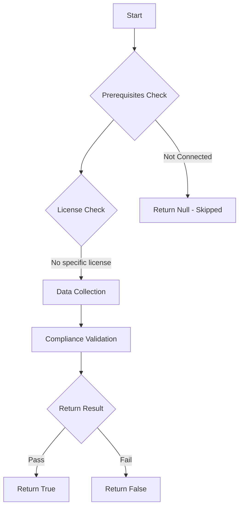

# Test-MtApplePushNotificationCertificate: Check the validity of the Apple Push Notification Service (APNS) Certificate for Intune.

## Overview

**Function Name:** `Test-MtApplePushNotificationCertificate`
**Category:** Maester/Intune

## Description

The Apple Push Notification Service (APNS) Certificate is required for managing Apple devices with Microsoft Intune. This command checks if the APNS certificate is valid and not expired.

## Workflow

## Phase Details

### Phase 1: Prerequisites Check

No specific prerequisites required.

### Phase 2: Data Collection

**Graph API Calls:**
- `deviceManagement/applePushNotificationCertificate`

**Cmdlets/Functions Used:**
- `Invoke-MtGraphRequest`

### Phase 3: Compliance Validation

The function validates the collected data against compliance requirements.

### Phase 4: Return Result

| Return Value | Meaning |
| --- | --- |
| `$true` | Compliant |
| `$false` | Non-Compliant |
| `$null` | Skipped (missing prerequisites, license, or error) |

## Original Documentation

Check the validity of the Apple Push Notification Service (APNS) Certificate for Intune. The Apple Push Notification Service (APNS) Certificate is required for managing Apple devices with Microsoft Intune. This test checks if the APNS certificate is valid and not expired.

#### Remediation action

It is critical that you renew your APNs certificate, not request a new one. This means you must ensure that you use the same Apple ID and renew the same certificate from Apple’s site. If you request a new certificate instead of renewing your existing certificate, you will be forced to unenroll and re-enroll all of your existing iOS devices.

See the [Microsoft learn instructions to Renew Apple MDM certificate](https://learn.microsoft.com/en-us/intune-education/renew-ios-certificate-token#renew-apple-mdm-certificate).

<!--- Results --->
%TestResult%

## Standalone Function

See the standalone compliance check function: [`Test-MtApplePushNotificationCertificateCompliance.ps1`](../../standalone-functions/Maester/Intune/Test-MtApplePushNotificationCertificateCompliance.ps1)
