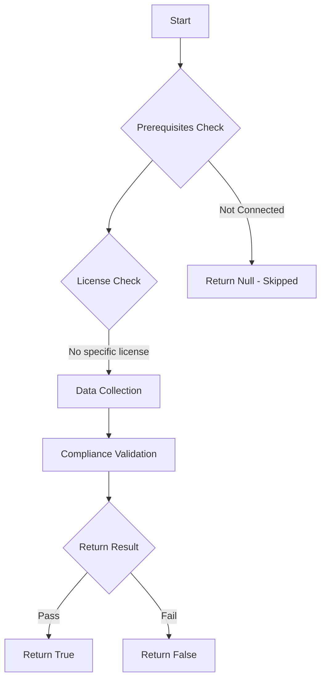

# Test-MtAppleVolumePurchaseProgramToken: Check the validity of the Apple Volume Purchase Program (VPP) token for Intune.

## Overview

**Function Name:** `Test-MtAppleVolumePurchaseProgramToken`
**Category:** Maester/Intune

## Description

The Apple Volume Purchase Program (VPP) token is required to synchronize Apple store apps with Microsoft Intune. This command checks if the VPP token is valid and not expired.

## Workflow

## Phase Details

### Phase 1: Prerequisites Check

No specific prerequisites required.

### Phase 2: Data Collection

**Graph API Calls:**
- `deviceAppManagement/vppTokens`

**Cmdlets/Functions Used:**
- `Invoke-MtGraphRequest`

### Phase 3: Compliance Validation

The function validates the collected data against compliance requirements.

### Phase 4: Return Result

| Return Value | Meaning |
| --- | --- |
| `$true` | Compliant |
| `$false` | Non-Compliant |
| `$null` | Skipped (missing prerequisites, license, or error) |

## Original Documentation

Check the validity of the Apple Volume Purchase Program (VPP) token for Intune. The Apple Volume Purchase Program (VPP) token is required to synchronize Apple store apps with Microsoft Intune. This test checks if the VPP token is valid and not expired.

#### Remediation action

See the [Microsoft learn instructions to Renew Apple VPP token](https://learn.microsoft.com/en-us/intune-education/renew-ios-certificate-token#renew-vpp-token).

<!--- Results --->
%TestResult%

## Standalone Function

See the standalone compliance check function: [`Test-MtAppleVolumePurchaseProgramTokenCompliance.ps1`](../../standalone-functions/Maester/Intune/Test-MtAppleVolumePurchaseProgramTokenCompliance.ps1)
