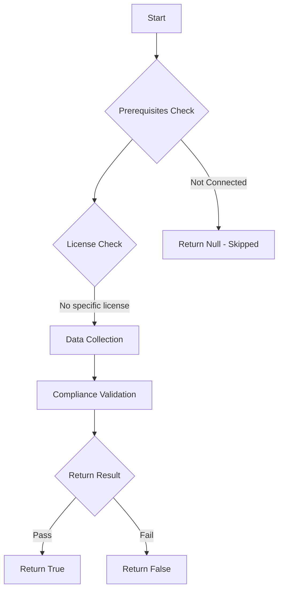

# Test-MtBitLockerFullDiskEncryption: Ensure at least one Intune Disk Encryption policy enforces BitLocker with full disk encryption type.

## Overview

**Function Name:** `Test-MtBitLockerFullDiskEncryption`
**Category:** Maester/Intune

## Description

Checks Intune Endpoint Security Disk Encryption policies (configurationPolicies API) for BitLocker
    profiles that enforce full disk encryption rather than "Used space only" encryption.

    BitLocker supports two encryption types with very different security implications:
    - "Full disk encryption" -- encrypts the entire drive including free space. This is the secure option.
    - "Used space only encryption" -- only encrypts sectors currently holding data. Previously deleted
      files that were written before encryption was enabled remain in unencrypted free space and can be
      recovered using data recovery software (e.g., Recuva, PhotoRec, or forensic tools). This is because
      NTFS marks sectors as free but does not zero them out -- the raw data stays on disk until overwritten.

    This test queries the configurationPolicies Graph API (used by Endpoint Security > Disk Encryption)
    which exposes the actual BitLocker CSP settings including:
    - SystemDrivesEncryptionType (OS drive encryption type: full vs used space only)
    - FixedDrivesEncryptionType (fixed drive encryption type: full vs used space only)
    - RequireDeviceEncryption (require BitLocker encryption)
    - EncryptionMethodByDriveType (cipher strength: XTS-AES 128/256, AES-CBC 128/256)

    The test passes only if at least one BitLocker Disk Encryption policy has the OS drive encryption
    type set to "Full encryption". It fails if no policies exist, if encryption type is set to
    "Used space only", or if the encryption type setting is not configured.

## Workflow

## Phase Details

### Phase 1: Prerequisites Check

No specific prerequisites required.

### Phase 2: Data Collection

**Graph API Calls:**
- `deviceManagement/configurationPolicies?`$filter=templateReference/templateFamily eq `

**Cmdlets/Functions Used:**
- `Invoke-MtGraphRequest`

### Phase 3: Compliance Validation

**Properties Checked:**

| Property | Expected Value |
| --- | --- |
| `OsEncryptionType` | `Used` |

### Phase 4: Return Result

| Return Value | Meaning |
| --- | --- |
| `$true` | Compliant |
| `$false` | Non-Compliant |
| `$null` | Skipped (missing prerequisites, license, or error) |

## Original Documentation

Ensure at least one Intune Disk Encryption policy enforces BitLocker with **full disk encryption type**.

BitLocker Drive Encryption protects data on Windows devices by encrypting the disk.
However, BitLocker supports two encryption types that have very different security implications:

- **Full disk encryption** — encrypts the entire drive including free space. This is the recommended and secure option.
- **Used space only encryption** — only encrypts sectors currently holding data. **This is dangerous on drives that previously contained unencrypted data**, because previously deleted files remain as raw data in unencrypted free space. This data can be recovered using commonly available data recovery software (e.g., Recuva, PhotoRec, or forensic imaging tools). NTFS marks deleted file sectors as "free" but does not zero them out — the original bytes stay on disk until overwritten by new data.

**Bottom line:** If BitLocker is enabled with "Used space only" on a drive that already had data on it before encryption was turned on, that pre-existing deleted data is fully recoverable. Only "Full disk encryption" guarantees that the entire drive surface is protected.

This test queries the Intune **Endpoint Security > Disk Encryption** policies via the `configurationPolicies` Graph API and inspects the BitLocker CSP settings to verify that **Enforce drive encryption type** is set to **Full encryption** for OS drives.

#### Remediation action:

1. Navigate to [Microsoft Intune admin center](https://intune.microsoft.com).
2. Go to **Endpoint security** > **Disk encryption**.
3. Click **+ Create policy**.
4. Set **Platform** to **Windows 10 and later** and **Profile** to **BitLocker**.
5. Enter a policy name (e.g., "BitLocker - Full Disk Encryption").
6. Configure the following settings:
   - **Require Device Encryption**: **Enabled**
   - **Allow Warning For Other Disk Encryption**: **Disabled** (enables silent encryption)
   - **Allow Standard User Encryption**: **Enabled**
   - **Enforce drive encryption type on operating system drives**: **Enabled**, set to **Full encryption**
   - **Enforce drive encryption type on fixed data drives**: **Enabled**, set to **Full encryption**
   - **Choose drive encryption method and cipher strength**: **Enabled**
     - OS drives: **XTS-AES 256-bit**
     - Fixed data drives: **XTS-AES 256-bit**
     - Removable data drives: **AES-CBC 256-bit**
   - **Require additional authentication at startup**: **Enabled**, with **Require TPM**
   - **Choose how BitLocker-protected OS drives can be recovered**: **Enabled**, with backup to Entra ID
7. Assign the policy to your device groups and click **Create**.

#### Related links

- [Microsoft Intune - Endpoint Security Disk Encryption](https://intune.microsoft.com/#view/Microsoft_Intune_Workflows/SecurityManagementMenu/~/diskEncryption)
- [Microsoft Learn - Encrypt devices with BitLocker in Intune](https://learn.microsoft.com/en-us/mem/intune/protect/encrypt-devices)
- [Microsoft Learn - BitLocker CSP reference](https://learn.microsoft.com/en-us/windows/client-management/mdm/bitlocker-csp)
- [CIS Benchmark - Ensure BitLocker is enabled on all Windows devices](https://www.cisecurity.org/benchmark/microsoft_intune_for_windows)

<!--- Results --->
%TestResult%

## Standalone Function

See the standalone compliance check function: [`Test-MtBitLockerFullDiskEncryptionCompliance.ps1`](../../standalone-functions/Maester/Intune/Test-MtBitLockerFullDiskEncryptionCompliance.ps1)
