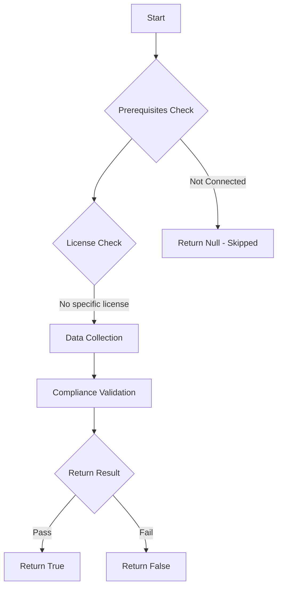

# Test-MtCertificateConnectors: Check Intune Certificate Connectors Health and Version

## Overview

**Function Name:** `Test-MtCertificateConnectors`
**Category:** Maester/Intune

## Description

All Intune Certificate Connectors should be healthy and running supported versions.

## Workflow

## Phase Details

### Phase 1: Prerequisites Check

No specific prerequisites required.

### Phase 2: Data Collection

**Graph API Calls:**
- `deviceManagement/ndesConnectors`

**Cmdlets/Functions Used:**
- `Invoke-MtGraphRequest`

### Phase 3: Compliance Validation

The function validates the collected data against compliance requirements.

### Phase 4: Return Result

| Return Value | Meaning |
| --- | --- |
| `$true` | Compliant |
| `$false` | Non-Compliant |
| `$null` | Skipped (missing prerequisites, license, or error) |

## Original Documentation

This check verifies that all Intune Certificate Connectors are healthy and running a supported Version.

#### Remediation action

1. Check the status of your certificate connectors in the [Intune Certifcate Connector blade](https://intune.microsoft.com/#view/Microsoft_Intune_DeviceSettings/TenantAdminConnectorsMenu/~/certConnectors)
2. Review the [Certificate Connector for Microsoft Intune Release Notes](https://learn.microsoft.com/en-us/intune/intune-service/protect/certificate-connector-overview#lifecycle)
3. Ensure the Certificate Connector servers are operational and running a recent version.

<!--- Results --->
%TestResult%

## Standalone Function

See the standalone compliance check function: [`Test-MtCertificateConnectorsCompliance.ps1`](../../standalone-functions/Maester/Intune/Test-MtCertificateConnectorsCompliance.ps1)
