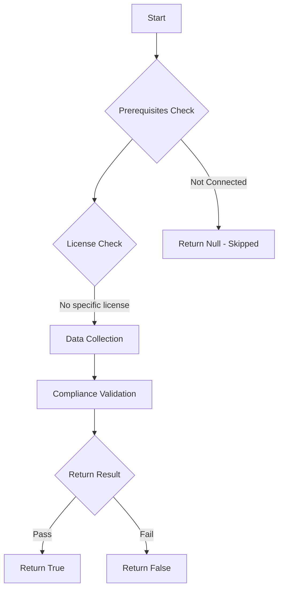

# Test-MtDeviceComplianceSettings: Ensure the built-in Device Compliance Policy marks devices with no compliance policy assigned as 'Not compliant'

## Overview

**Function Name:** `Test-MtDeviceComplianceSettings`
**Category:** Maester/Intune

## Description

The built-in Device Compliance Policy should mark devices with no compliance policy assigned as 'Not compliant'

## Workflow

## Phase Details

### Phase 1: Prerequisites Check

No specific prerequisites required.

### Phase 2: Data Collection

**Graph API Calls:**
- `deviceManagement/settings`

**Cmdlets/Functions Used:**
- `Invoke-MtGraphRequest`

### Phase 3: Compliance Validation

The function validates the collected data against compliance requirements.

### Phase 4: Return Result

| Return Value | Meaning |
| --- | --- |
| `$true` | Compliant |
| `$false` | Non-Compliant |
| `$null` | Skipped (missing prerequisites, license, or error) |

## Original Documentation

Ensure the built-in Device Compliance Policy marks devices with no compliance policy assigned as 'Not compliant'.

Set your Intune built-in Device Compliance Policy to mark devices with no compliance policy assigned as 'Not compliant'.
This ensures that new devices that do not have any policies assigned are not compliant per default.

#### Remediation action:

To change the built-in device compliance policy:
1. Navigate to [Microsoft Intune admin center](https://intune.microsoft.com).
2. Click **Devices** scroll down to **Manage devices**.
3. Select **Compliance** and Select **Compliance settings**.
4. Set **Mark devices with no compliance policy assigned as** to **Not compliant**
5. Click **Save**.

#### Related links

* [Microsoft 365 Admin Center](https://admin.microsoft.com)
* [Microsoft Intune - Compliance](https://intune.microsoft.com/?ref=AdminCenter#view/Microsoft_Intune_DeviceSettings/DevicesMenu/~/compliance)
* [Compliance policy settings](https://learn.microsoft.com/de-de/mem/intune/protect/device-compliance-get-started#compliance-policy-settings)

<!--- Results --->
%TestResult%

## Standalone Function

See the standalone compliance check function: [`Test-MtDeviceComplianceSettingsCompliance.ps1`](../../standalone-functions/Maester/Intune/Test-MtDeviceComplianceSettingsCompliance.ps1)
