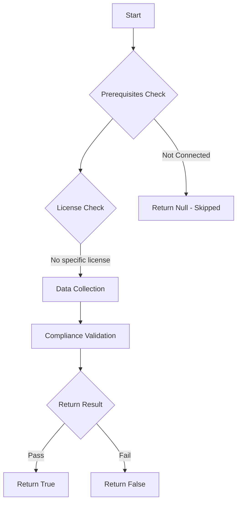

# Test-MtFeatureUpdatePolicy: Check whether a Windows Feature Update Policy in Intune is using unsupported builds.

## Overview

**Function Name:** `Test-MtFeatureUpdatePolicy`
**Category:** Maester/Intune

## Description

This command checks the Windows Feature Update Policies configured in Microsoft Intune to identify any policies that are using Windows builds that are no longer supported by Microsoft.

## Workflow

## Phase Details

### Phase 1: Prerequisites Check

No specific prerequisites required.

### Phase 2: Data Collection

**Graph API Calls:**
- `deviceManagement/windowsFeatureUpdateProfiles`

**Cmdlets/Functions Used:**
- `Invoke-MtGraphRequest`

### Phase 3: Compliance Validation

**Properties Checked:**

| Property | Expected Value |
| --- | --- |
| `endOfSupportDate` | `(Get-Date)` |

### Phase 4: Return Result

| Return Value | Meaning |
| --- | --- |
| `$true` | Compliant |
| `$false` | Non-Compliant |
| `$null` | Skipped (missing prerequisites, license, or error) |

## Original Documentation

This test checks for Windows Feature Update policies referencing unsupported Windows build versions.
Additional information about Feature Update Policies: [Microsoft learn - Feature updates for Windows 10 and later policy in Intune](https://learn.microsoft.com/en-us/intune/intune-service/protect/windows-10-feature-updates).

#### Remediation action

1. Visit the Intune Portal [Windows updates blade for feature updates](https://intune.microsoft.com/#view/Microsoft_Intune_DeviceSettings/DevicesMenu/~/windows10Update)
2. Edit the affected feature update policy and select a supported Windows 11 OS version, save the policy.

<!--- Results --->
%TestResult%

## Standalone Function

See the standalone compliance check function: [`Test-MtFeatureUpdatePolicyCompliance.ps1`](../../standalone-functions/Maester/Intune/Test-MtFeatureUpdatePolicyCompliance.ps1)
