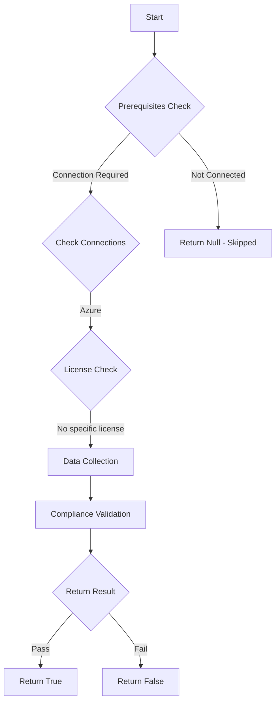

# Test-MtIntuneDiagnosticSettings: Check the Intune Diagnostic Settings for Audit Logs.

## Overview

**Function Name:** `Test-MtIntuneDiagnosticSettings`
**Category:** Maester/Intune

## Description

Enumerate all diagnostic settings for Intune and check if Audit Logs are being sent to a destination (Log Analytics, Storage Account, Event Hub).

## Workflow



## Phase Details

### Phase 1: Prerequisites Check

**Required Connections:**
- Azure

### Phase 2: Data Collection

**Cmdlets/Functions Used:**
- `Invoke-AzRestMethod`

### Phase 3: Compliance Validation

**Properties Checked:**

| Property | Expected Value |
| --- | --- |
| `category` | `AuditLogs` |
| `enabled` | `$true` |

### Phase 4: Return Result

| Return Value | Meaning |
| --- | --- |
| `$true` | Compliant |
| `$false` | Non-Compliant |
| `$null` | Skipped (missing prerequisites, license, or error) |

## Original Documentation

This test checks for the existence of Intune Diagnostic settings collecting Intune Audit Logs.

#### Test Prerequisites

For this test to run, the executing principal must have permissions to read Intune diagnostic settings in Azure (`microsoft.intune/diagnosticSettings/read` action). This typically requires at least the 'Monitoring Reader' or 'Reader' Azure role assigned at the subscription level (for example, with scope `/subscriptions/$SubscriptionId`), which provides access to the provider-level Intune diagnostic settings.

Alternatively, you can create a custom RBAC role with the following snippet:

```powershell
# Get the subscription ID and user ID from the current context. Change if necessary.
$SubscriptionId = "$((Get-AzContext).Subscription.Id)"
$UserId = (Get-AzADUser -UserPrincipalName (Get-AzContext).Account.Id).Id

$CustomRole = @{
    Name = 'Intune Diagnostic Settings Reader'
    Description = 'Can read Intune diagnostic settings only'
    Actions = @('microsoft.intune/diagnosticSettings/read')
    NotActions = @()
    AssignableScopes = @("/subscriptions/$SubscriptionId")
}

New-AzRoleDefinition -Role $CustomRole

# Assign the custom role at subscription level
New-AzRoleAssignment -ObjectId $UserId -RoleDefinitionName 'Intune Diagnostic Settings Reader' -Scope "/subscriptions/$SubscriptionId"
```

#### Remediation action

* Check the following Microsoft learn article to [Send Intune log data to Azure Storage, Event Hubs, or Log Analytics](https://learn.microsoft.com/en-us/intune/intune-service/fundamentals/review-logs-using-azure-monitor).

* Existing diagnostic settings can be viewed within the [Intune Diagnostics settings blade](https://intune.microsoft.com/#view/Microsoft_Intune_DeviceSettings/TenantAdminMenu/~/diagnostics).


<!--- Results --->
%TestResult%

## Standalone Function

See the standalone compliance check function: [`Test-MtIntuneDiagnosticSettingsCompliance.ps1`](../../standalone-functions/Maester/Intune/Test-MtIntuneDiagnosticSettingsCompliance.ps1)
