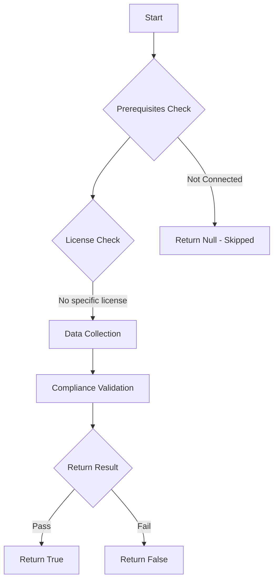

# Test-MtIntuneRbacGroupsProtected: 

## Overview

**Function Name:** `Test-MtIntuneRbacGroupsProtected`
**Category:** Maester/Intune

## Description

## Workflow

## Phase Details

### Phase 1: Prerequisites Check

No specific prerequisites required.

### Phase 2: Data Collection

**Graph API Calls:**
- `deviceManagement/roleDefinitions/$($definition.id)/roleAssignments`
- `groups/$memberId`
- `deviceManagement/roleDefinitions`
- `deviceManagement/roleAssignments/$($assignment.id)`

**Cmdlets/Functions Used:**
- `Invoke-MtGraphRequest`

### Phase 3: Compliance Validation

The function validates the collected data against compliance requirements.

### Phase 4: Return Result

| Return Value | Meaning |
| --- | --- |
| `$true` | Compliant |
| `$false` | Non-Compliant |
| `$null` | Skipped (missing prerequisites, license, or error) |

## Original Documentation

This test checks whether Intune RBAC groups are protected either via Entra Restricted Management Administrative Unit or Role Assignable group.

#### Remediation action

* Add unprotected Entra security groups to a Restricted Management Administrative Unit

Additional information:

* See [Restricted management administrative units in Microsoft Entra ID - Microsoft Learn](https://learn.microsoft.com/en-us/entra/identity/role-based-access-control/admin-units-restricted-management)

<!--- Results --->
%TestResult%

## Standalone Function

See the standalone compliance check function: [`Test-MtIntuneRbacGroupsProtectedCompliance.ps1`](../../standalone-functions/Maester/Intune/Test-MtIntuneRbacGroupsProtectedCompliance.ps1)
