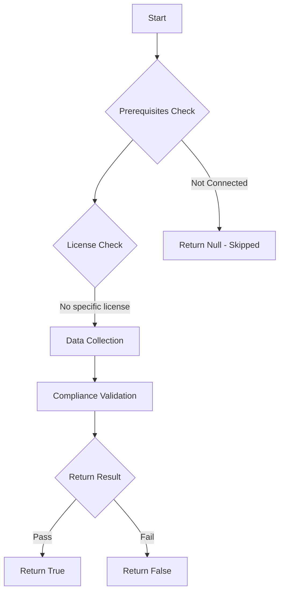

# Test-MtManagedDeviceCleanupSettings: Ensure device clean-up rule is configured

## Overview

**Function Name:** `Test-MtManagedDeviceCleanupSettings`
**Category:** Maester/Intune

## Description

The device clean-up rule should be configured

## Workflow

## Phase Details

### Phase 1: Prerequisites Check

No specific prerequisites required.

### Phase 2: Data Collection

**Graph API Calls:**
- `deviceManagement/managedDeviceCleanupRules`

**Cmdlets/Functions Used:**
- `Invoke-MtGraphRequest`

### Phase 3: Compliance Validation

The function validates the collected data against compliance requirements.

### Phase 4: Return Result

| Return Value | Meaning |
| --- | --- |
| `$true` | Compliant |
| `$false` | Non-Compliant |
| `$null` | Skipped (missing prerequisites, license, or error) |

## Original Documentation

Ensure device clean-up rule is configured

This test checks if the device clean-up rule is configured.

Set your Intune device cleanup rules to delete Intune MDM enrolled devices that appear inactive, stale, or unresponsive. Intune applies cleanup rules immediately and continuously so that your device records remain current.

#### Remediation action:

To enable device clean-up rules:

- Open [Microsoft Intune - Device clean-up rules](https://intune.microsoft.com/?ref=AdminCenter#view/Microsoft_Intune_DeviceSettings/DevicesMenu/~/deviceCleanUp)
  - Or navigate to [Microsoft Intune admin center](https://intune.microsoft.com) > **Devices** > **Organize devices** > **Device clean-up rules**.
- Select **Create**.
- Set **Name** and **Platform**.
- Enter **30 days or more** depending on your organizational needs.
- Click **Next**.
- Click **Create**.

#### Related links

- [Automatically hide devices with cleanup rules](https://learn.microsoft.com/en-us/intune/intune-service/remote-actions/devices-wipe#automatically-hide-devices-with-cleanup-rules)

<!--- Results --->
%TestResult%

## Standalone Function

See the standalone compliance check function: [`Test-MtManagedDeviceCleanupSettingsCompliance.ps1`](../../standalone-functions/Maester/Intune/Test-MtManagedDeviceCleanupSettingsCompliance.ps1)
