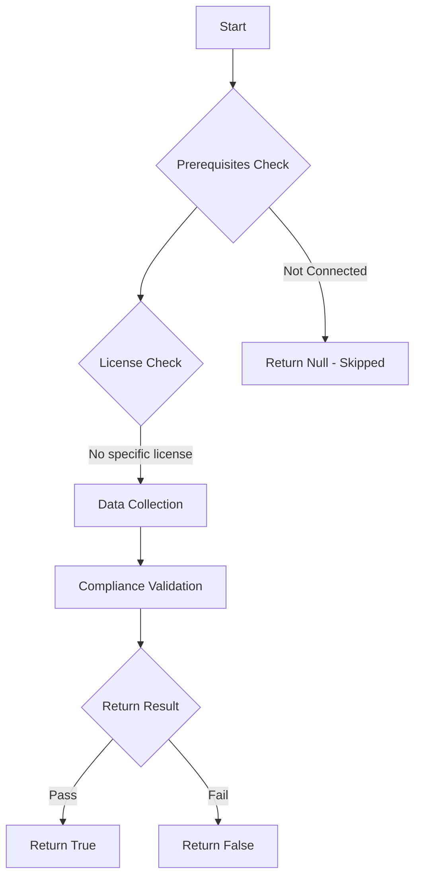

# Test-MtMdmAuthority: Check the MDM Authority for Intune.

## Overview

**Function Name:** `Test-MtMdmAuthority`
**Category:** Maester/Intune

## Description

This command checks the Mobile Device Management (MDM) Authority setting in Microsoft Intune to determine if Intune is the configured MDM authority.

## Workflow

## Phase Details

### Phase 1: Prerequisites Check

No specific prerequisites required.

### Phase 2: Data Collection

**Graph API Calls:**
- `organization`
- `organization/$($org.id)?`$select=mobiledevicemanagementauthority`

**Cmdlets/Functions Used:**
- `Invoke-MtGraphRequest`

### Phase 3: Compliance Validation

The function validates the collected data against compliance requirements.

### Phase 4: Return Result

| Return Value | Meaning |
| --- | --- |
| `$true` | Compliant |
| `$false` | Non-Compliant |
| `$null` | Skipped (missing prerequisites, license, or error) |

## Original Documentation

This test verifies whether Microsoft Intune is set as MDM authority. In tenants where Intune is used to provision and manage devices, this should be automatically the case.

#### Remediation action

1. In the Microsoft Intune admin center, select the orange banner to open the Mobile Device Management Authority setting. The orange banner is only displayed if you haven't yet set the MDM authority. If the orange banner is not visible, you can navigate directly to the [MDM Authority settings](https://intune.microsoft.com/#view/Microsoft_Intune_Enrollment/ChooseMDMAuthorityBlade) to configure the MDM authority.

2. Under Mobile Device Management Authority, choose your MDM authority to: Intune MDM Authority

Additional information:

* [Set the mobile device management authority](https://learn.microsoft.com/intune/intune-service/fundamentals/mdm-authority-set)

<!--- Results --->
%TestResult%

## Standalone Function

See the standalone compliance check function: [`Test-MtMdmAuthorityCompliance.ps1`](../../standalone-functions/Maester/Intune/Test-MtMdmAuthorityCompliance.ps1)
