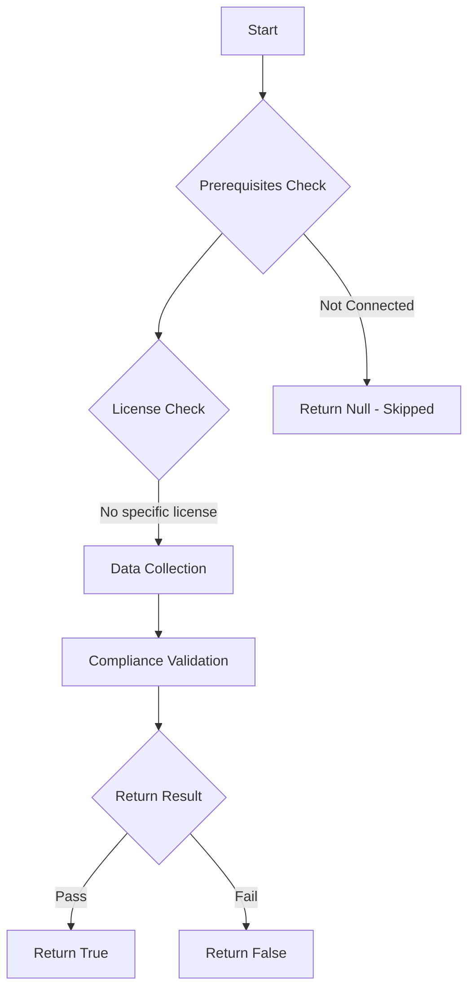

# Test-MtMobileThreatDefenseConnectors: Check the Intune Mobile Threat Defense Connectors.

## Overview

**Function Name:** `Test-MtMobileThreatDefenseConnectors`
**Category:** Maester/Intune

## Description

This command checks the Mobile Threat Defense Connectors configured in Microsoft Intune to determine their status and connectivity.

## Workflow

## Phase Details

### Phase 1: Prerequisites Check

No specific prerequisites required.

### Phase 2: Data Collection

**Graph API Calls:**
- `deviceManagement/mobileThreatDefenseConnectors`

**Cmdlets/Functions Used:**
- `Invoke-MtGraphRequest`

### Phase 3: Compliance Validation

The function validates the collected data against compliance requirements.

### Phase 4: Return Result

| Return Value | Meaning |
| --- | --- |
| `$true` | Compliant |
| `$false` | Non-Compliant |
| `$null` | Skipped (missing prerequisites, license, or error) |

## Original Documentation

This test verifies the health of Intune Mobile Threat Defense Connectors, including Microsoft Defender for Endpoint.

#### Remediation action

For Microsoft Defender for Endpoint visit the [Microsoft Defender for Endpoint Tenant Settings](https://intune.microsoft.com/#view/Microsoft_Intune_DeviceSettings/TenantAdminConnectorsMenu/~/windowsDefenderATP) and ensure that the connector is also enabled from the Microsoft Defender XDR Settings as part of the [Microsoft Intune connection](https://security.microsoft.com/securitysettings/endpoints/integration).

Additional information:

* [Integrate Microsoft Defender for Endpoint with Intune and Onboard Devices](https://learn.microsoft.com/intune/intune-service/protect/microsoft-defender-integrate)

* If you have a third party connector, consult your third party MTD solution. More information can be found on the [Mobile Threat Defense integration with Intune](https://learn.microsoft.com/intune/intune-service/protect/mobile-threat-defense#connector-status) learn page.

<!--- Results --->
%TestResult%

## Standalone Function

See the standalone compliance check function: [`Test-MtMobileThreatDefenseConnectorsCompliance.ps1`](../../standalone-functions/Maester/Intune/Test-MtMobileThreatDefenseConnectorsCompliance.ps1)
