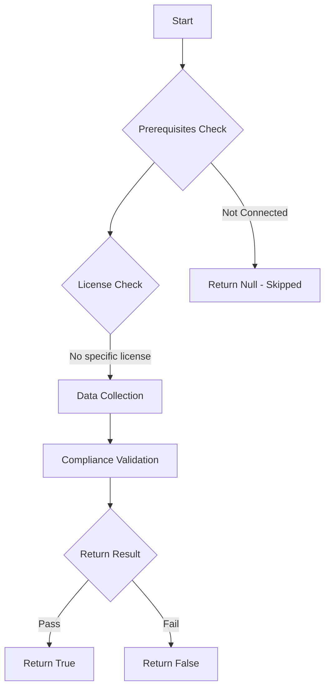

# Test-MtOperationApprovalPolicies: Check for the usage of Intune Multi Admin Approval Policies

## Overview

**Function Name:** `Test-MtOperationApprovalPolicies`
**Category:** Maester/Intune

## Description

At least one Intune Multi Admin Approval Policy should be configured

## Workflow

## Phase Details

### Phase 1: Prerequisites Check

No specific prerequisites required.

### Phase 2: Data Collection

**Graph API Calls:**
- `deviceManagement/operationApprovalPolicies`

**Cmdlets/Functions Used:**
- `Invoke-MtGraphRequest`

### Phase 3: Compliance Validation

The function validates the collected data against compliance requirements.

### Phase 4: Return Result

| Return Value | Meaning |
| --- | --- |
| `$true` | Compliant |
| `$false` | Non-Compliant |
| `$null` | Skipped (missing prerequisites, license, or error) |

## Original Documentation

Ensure at least one Intune Multi Admin Approval Policy is configured. Microsoft Intune Multi Admin Approval helps to limit the impact of compromised administrators by requiring approval for sensitive activities.

#### Remediation action:

To create a multi admin approval policy:
1. Navigate to [Microsoft Intune admin center](https://intune.microsoft.com).
2. Click **Tenant Administration** and select **Multi Admin Approval** or use the [Microsoft Intune Portal - Multi Admin Approval direct link](https://intune.microsoft.com/#view/Microsoft_Intune_DeviceSettings/TenantAdminMenu/~/multiAdminApproval).
3. Select **Access policies** and create a new access policy, e.g. for Scripts
4. Let another Intune Administrator approve your request to create the access policy
5. Re-visit the access policies section and complete the policy creation.

Additional information:

* [Use Access policies to require Multi Admin Approval](https://learn.microsoft.com/intune/intune-service/fundamentals/multi-admin-approval)

<!--- Results --->
%TestResult%

## Standalone Function

See the standalone compliance check function: [`Test-MtOperationApprovalPoliciesCompliance.ps1`](../../standalone-functions/Maester/Intune/Test-MtOperationApprovalPoliciesCompliance.ps1)
