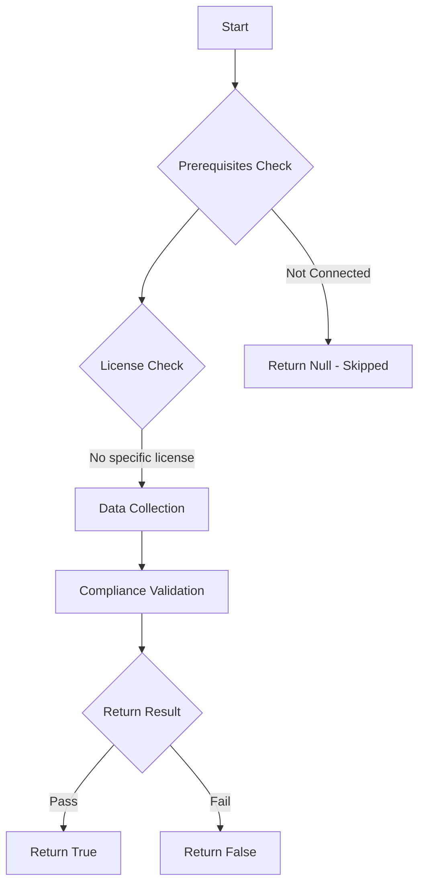

# Test-MtTenantCustomization: Check the Intune Tenant Customization.

## Overview

**Function Name:** `Test-MtTenantCustomization`
**Category:** Maester/Intune

## Description

This command checks the Intune Tenant Customization settings, specifically the Default Branding Profile, to determine if it has been customized.

## Workflow

## Phase Details

### Phase 1: Prerequisites Check

No specific prerequisites required.

### Phase 2: Data Collection

**Graph API Calls:**
- `deviceManagement/intuneBrandingProfiles`

**Cmdlets/Functions Used:**
- `Invoke-MtGraphRequest`

### Phase 3: Compliance Validation

The function validates the collected data against compliance requirements.

### Phase 4: Return Result

| Return Value | Meaning |
| --- | --- |
| `$true` | Compliant |
| `$false` | Non-Compliant |
| `$null` | Skipped (missing prerequisites, license, or error) |

## Original Documentation

Test whether the Intune built-in tenant customization settings are configured.

#### Remediation action

1. Visit the [Tenant Administration - Customization blade](https://intune.microsoft.com/#view/Microsoft_Intune_DeviceSettings/TenantAdminMenu/~/companyPortalBranding) in the Intune Portal
2. Choose the `Default` customization profile or create a new one and supply at least the company name and a logo to have your company portal customized.

Additional information:

* [How to Configure the Intune Company Portal Apps, Company Portal Website, and Intune App](https://learn.microsoft.com/intune/intune-service/apps/company-portal-app)

<!--- Results --->
%TestResult%

## Standalone Function

See the standalone compliance check function: [`Test-MtTenantCustomizationCompliance.ps1`](../../standalone-functions/Maester/Intune/Test-MtTenantCustomizationCompliance.ps1)
