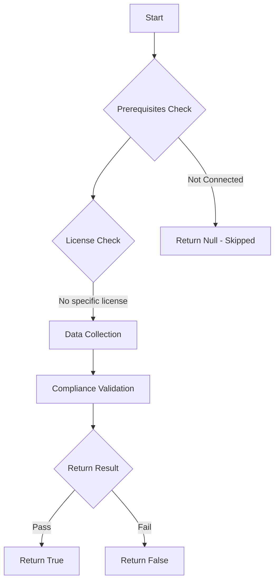

# Test-MtWindowsDataProcessor: Check the Intune Windows Data Processor settings.

## Overview

**Function Name:** `Test-MtWindowsDataProcessor`
**Category:** Maester/Intune

## Description

This command checks the Windows Data Processor settings in Microsoft Intune to determine if features requiring Windows diagnostic data are enabled and if the Windows license verification is complete.

## Workflow

## Phase Details

### Phase 1: Prerequisites Check

No specific prerequisites required.

### Phase 2: Data Collection

**Graph API Calls:**
- `deviceManagement/dataProcessorServiceForWindowsFeaturesOnboarding`

**Cmdlets/Functions Used:**
- `Invoke-MtGraphRequest`

### Phase 3: Compliance Validation

The function validates the collected data against compliance requirements.

### Phase 4: Return Result

| Return Value | Meaning |
| --- | --- |
| `$true` | Compliant |
| `$false` | Non-Compliant |
| `$null` | Skipped (missing prerequisites, license, or error) |

## Original Documentation

Test whether Windows diagnostic data processor configuration is enabled. Before you can use some Intune features, you must enable Windows diagnostic data in processor configuration for your tenant. Doing so enables you as the controller of Windows diagnostic data collected from your devices to then allow its use by Intune when it's required by features that are dependent on that data.

In addition, several of the features that require Windows diagnostic data also require you to have Windows E3 (or equivalent) licenses, and you must attest to having these licenses to enable use of those features.

#### Remediation action

1. To manage Windows data configurations for your tenant, open the Microsoft Intune admin center visit the [Windows data blade](https://intune.microsoft.com/#view/Microsoft_Intune_DeviceSettings/TenantAdminConnectorsMenu/~/windowsDataConnector) under the Tenant Administration.

2. On the Windows data page, you can configure your tenant to support Windows diagnostic data in processor configuration, and to attest ownership of the required Windows E3 or equivalent licenses. It's possible that some features require only one of the available configurations to be enabled, while other features could require both.

Additional information:

* [Enable use of Windows diagnostic data by Intune](https://learn.microsoft.com/intune/intune-service/protect/data-enable-windows-data)
* [Enable Windows diagnostic data processor configuration](https://learn.microsoft.com/windows/privacy/configure-windows-diagnostic-data-in-your-organization#enable-windows-diagnostic-data-processor-configuration)

<!--- Results --->
%TestResult%

## Standalone Function

See the standalone compliance check function: [`Test-MtWindowsDataProcessorCompliance.ps1`](../../standalone-functions/Maester/Intune/Test-MtWindowsDataProcessorCompliance.ps1)
