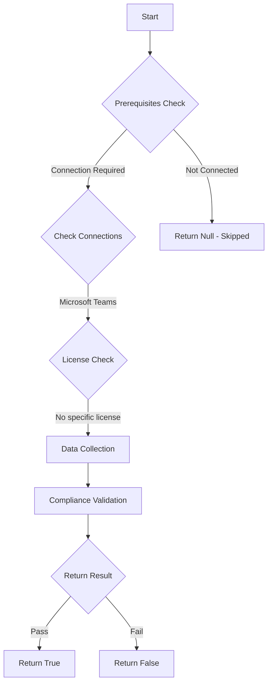

# Test-MtTeamsRestrictParticipantGiveRequestControl: 

## Overview

**Function Name:** `Test-MtTeamsRestrictParticipantGiveRequestControl`
**Category:** Maester/Teams

## Description

## Workflow

## Phase Details

### Phase 1: Prerequisites Check

**Required Connections:**
- Microsoft Teams

### Phase 2: Data Collection

### Phase 3: Compliance Validation

**Properties Checked:**

| Property | Expected Value |
| --- | --- |
| `Identity` | `Global` |

### Phase 4: Return Result

| Return Value | Meaning |
| --- | --- |
| `$true` | Compliant |
| `$false` | Non-Compliant |
| `$null` | Skipped (missing prerequisites, license, or error) |

## Original Documentation

This test checks the Org-wide default meeting policy is configured to only allow users in the **Presenter** role to request control and share content during meetings.

Restricting who can present limits meeting disruptions and reduces the risk of unwanted or inappropriate content being shared.

#### Remediation action:

To prevent standard attendees from sharing content during Teams meetings:

1. Click here to open [**Org-wide default settings > Meetings**](https://admin.teams.microsoft.com/one-policy/settings/meeting)
   * Or navigate to [Teams Admin Center](https://admin.teams.microsoft.com).
   * Click **Settings & policies > Org-wide default settings > Meetings**.
1. Scroll to the **Content sharing** section.
1. Set **Participants can give or request control** to **Off**.
1. Click Save.

#### Related links

* [Manage meeting policies for content sharing](https://learn.microsoft.com/en-us/microsoftteams/meeting-policies-content-sharing)
* [7 tips for safe online meetings and collaboration with Microsoft Teams - Tip 3: Determine who can present content or share their screen in your Teams meeting](https://techcommunity.microsoft.com/blog/microsoftteamsblog/7-tips-for-safe-online-meetings-and-collaboration-with-microsoft-teams/2072303)

<!--- Results --->

%TestResult%

## Standalone Function

See the standalone compliance check function: [`Test-MtTeamsRestrictParticipantGiveRequestControlCompliance.ps1`](../../standalone-functions/Maester/Teams/Test-MtTeamsRestrictParticipantGiveRequestControlCompliance.ps1)
