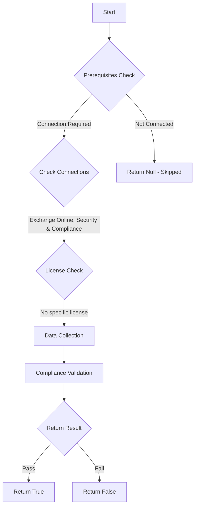

# ORCA: Bulk Complaint Level threshold is between 4 and 6.

## Overview

**Function Name:** `Test-ORCA100`
**Category:** ORCA
**Test Tag:** `ORCA`

## Description

Generated on 08/10/2025 15:41:31 by .\build\orca\Update-OrcaTests.ps1

## Workflow

## Phase Details

### Phase 1: Prerequisites Check

**Required Connections:**
- Exchange Online
- Security & Compliance

### Phase 2: Data Collection

**Cmdlets/Functions Used:**
- `Get-ORCACollection`

### Phase 3: Compliance Validation

The function validates the collected data against compliance requirements.

### Phase 4: Return Result

| Return Value | Meaning |
| --- | --- |
| `$true` | Compliant |
| `$false` | Non-Compliant |
| `$null` | Skipped (missing prerequisites, license, or error) |

## Original Documentation

The differentiation between bulk and spam can sometimes be subjective. The bulk complaint level is based on the number of complaints from the sender. Decreasing the threshold can decrease the amount of perceived spam received, however, too low may be considered too strict.

#### Remediation action
Set the Bulk Complaint Level threshold to be 6.

#### Related Links

* [Bulk Complaint Level values](https://aka.ms/orca-antispam-docs-1) 
* [Microsoft 365 Defender Portal - Anti-spam settings](https://security.microsoft.com/antispam) 
* [Recommended settings for EOP and Microsoft Defender for Office 365 security](https://aka.ms/orca-atpp-docs-6)

## Standalone Function

See the standalone compliance check function: [`Test-ORCA100Compliance.ps1`](../../standalone-functions/ORCA/Test-ORCA100Compliance.ps1)
