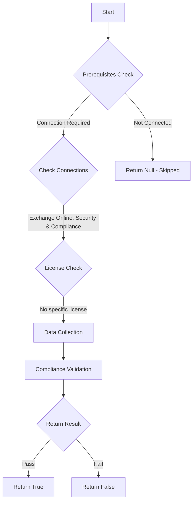

# ORCA: Bulk is marked as spam.

## Overview

**Function Name:** `Test-ORCA101`
**Category:** ORCA
**Test Tag:** `ORCA`

## Description

Generated on 08/10/2025 15:41:31 by .\build\orca\Update-OrcaTests.ps1

## Workflow

## Phase Details

### Phase 1: Prerequisites Check

**Required Connections:**
- Exchange Online
- Security & Compliance

### Phase 2: Data Collection

**Cmdlets/Functions Used:**
- `Get-ORCACollection`

### Phase 3: Compliance Validation

The function validates the collected data against compliance requirements.

### Phase 4: Return Result

| Return Value | Meaning |
| --- | --- |
| `$true` | Compliant |
| `$false` | Non-Compliant |
| `$null` | Skipped (missing prerequisites, license, or error) |

## Original Documentation

The differentiation between bulk and spam can sometimes be subjective. The bulk complaint level is based on the number of complaints from the sender. Marking bulk as spam can decrease the amount of perceived spam received. This setting is only available in PowerShell.

#### Remediation action
Set the anti-spam policy to mark bulk mail as spam.

#### Related Links

* [Recommended settings for EOP and Microsoft Defender for Office 365 security](https://aka.ms/orca-atpp-docs-6) 
* [Set-HostedContentFilterPolicy](https://aka.ms/orca-antispam-docs-9)

## Standalone Function

See the standalone compliance check function: [`Test-ORCA101Compliance.ps1`](../../standalone-functions/ORCA/Test-ORCA101Compliance.ps1)
