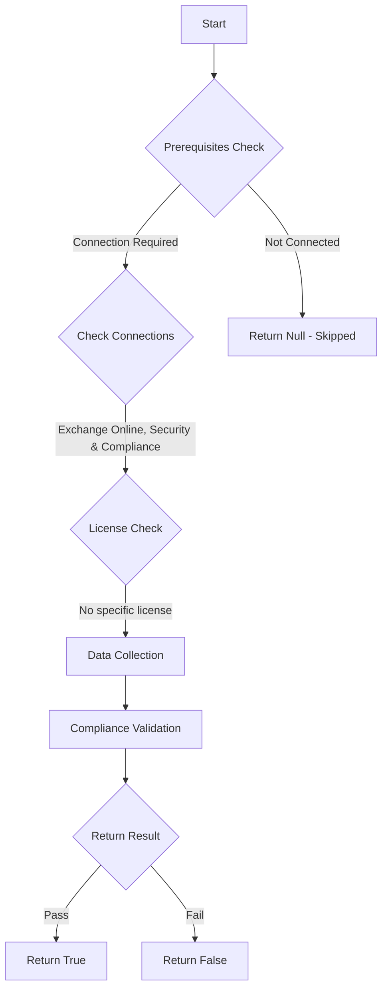

# ORCA: Advanced Spam filter options are turned off.

## Overview

**Function Name:** `Test-ORCA102`
**Category:** ORCA
**Test Tag:** `ORCA`

## Description

Generated on 08/10/2025 15:41:31 by .\build\orca\Update-OrcaTests.ps1

## Workflow

## Phase Details

### Phase 1: Prerequisites Check

**Required Connections:**
- Exchange Online
- Security & Compliance

### Phase 2: Data Collection

**Cmdlets/Functions Used:**
- `Get-ORCACollection`

### Phase 3: Compliance Validation

The function validates the collected data against compliance requirements.

### Phase 4: Return Result

| Return Value | Meaning |
| --- | --- |
| `$true` | Compliant |
| `$false` | Non-Compliant |
| `$null` | Skipped (missing prerequisites, license, or error) |

## Original Documentation

Enabling one or more of the ASF settings is an aggressive approach to spam filtering that can often cause false positives. The effectiveness of these settings in reducing spam has severely declined over the years. Use them with caution.

#### Remediation action
Turn off Advanced Spam filter (ASF) options in Anti-Spam filter policies.

#### Related Links

* [Microsoft 365 Defender Portal - Anti-spam settings](https://security.microsoft.com/antispam) 
* [Recommended settings for EOP and Microsoft Defender for Office 365 security](https://aka.ms/orca-atpp-docs-6)

## Standalone Function

See the standalone compliance check function: [`Test-ORCA102Compliance.ps1`](../../standalone-functions/ORCA/Test-ORCA102Compliance.ps1)
