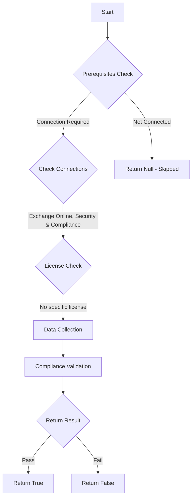

# ORCA: Outbound spam filter policy settings configured.

## Overview

**Function Name:** `Test-ORCA103`
**Category:** ORCA
**Test Tag:** `ORCA`

## Description

Generated on 08/10/2025 15:41:31 by .\build\orca\Update-OrcaTests.ps1

## Workflow

## Phase Details

### Phase 1: Prerequisites Check

**Required Connections:**
- Exchange Online
- Security & Compliance

### Phase 2: Data Collection

**Cmdlets/Functions Used:**
- `Get-ORCACollection`

### Phase 3: Compliance Validation

The function validates the collected data against compliance requirements.

### Phase 4: Return Result

| Return Value | Meaning |
| --- | --- |
| `$true` | Compliant |
| `$false` | Non-Compliant |
| `$null` | Skipped (missing prerequisites, license, or error) |

## Original Documentation

Configure the maximum number of recipients that a user can send to, per hour for internal (RecipientLimitInternalPerHour) and external recipients (RecipientLimitExternalPerHour) and maximum number per day for outbound email. It is common, after an account compromise incident, for an attacker to use the account to generate spam and phish. Configuring the recommended values can reduce the impact, but also allows you to receive notifications when these thresholds have been reached.

#### Remediation action
Set RecipientLimitExternalPerHour to 500, RecipientLimitInternalPerHour to 1000, and ActionWhenThresholdReached to block.

#### Related Links

* [Microsoft 365 Defender Portal - Anti-spam settings](https://security.microsoft.com/antispam) 
* [Recommended settings for EOP and Microsoft Defender for Office 365 security](https://aka.ms/orca-atpp-docs-6)

## Standalone Function

See the standalone compliance check function: [`Test-ORCA103Compliance.ps1`](../../standalone-functions/ORCA/Test-ORCA103Compliance.ps1)
