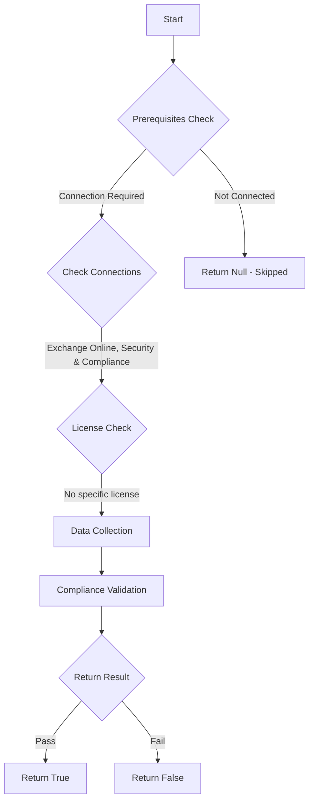

# ORCA: Safe Links Synchronous URL detonation is enabled.

## Overview

**Function Name:** `Test-ORCA105`
**Category:** ORCA
**Test Tag:** `ORCA`

## Description

Generated on 08/10/2025 15:41:31 by .\build\orca\Update-OrcaTests.ps1

## Workflow

## Phase Details

### Phase 1: Prerequisites Check

**Required Connections:**
- Exchange Online
- Security & Compliance

### Phase 2: Data Collection

**Cmdlets/Functions Used:**
- `Get-ORCACollection`

### Phase 3: Compliance Validation

The function validates the collected data against compliance requirements.

### Phase 4: Return Result

| Return Value | Meaning |
| --- | --- |
| `$true` | Compliant |
| `$false` | Non-Compliant |
| `$null` | Skipped (missing prerequisites, license, or error) |

## Original Documentation

When the 'Wait for URL scanning to complete before delivering the message' option is configured, messages that contain URLs to be scanned will be held until the URLs finish scanning and are confirmed to be safe before the messages are delivered.

#### Remediation action
Enable Safe Links Synchronous URL detonation.

#### Related Links

* [Microsoft 365 Defender Portal - Safe links](https://security.microsoft.com/safelinksv2) 
* [Recommended settings for EOP and Office 365 Microsoft Defender for Office 365 security](https://aka.ms/orca-atpp-docs-7) 
* [Set up Microsoft Defender for Office 365 Safe Links policies](https://aka.ms/orca-atpp-docs-10)

## Standalone Function

See the standalone compliance check function: [`Test-ORCA105Compliance.ps1`](../../standalone-functions/ORCA/Test-ORCA105Compliance.ps1)
