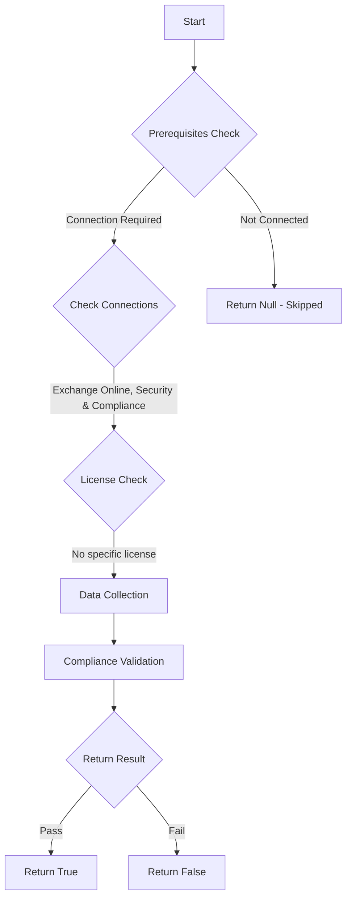

# ORCA: Quarantine retention period is 30 days.

## Overview

**Function Name:** `Test-ORCA106`
**Category:** ORCA
**Test Tag:** `ORCA`

## Description

Generated on 08/10/2025 15:41:31 by .\build\orca\Update-OrcaTests.ps1

## Workflow

## Phase Details

### Phase 1: Prerequisites Check

**Required Connections:**
- Exchange Online
- Security & Compliance

### Phase 2: Data Collection

**Cmdlets/Functions Used:**
- `Get-ORCACollection`

### Phase 3: Compliance Validation

The function validates the collected data against compliance requirements.

### Phase 4: Return Result

| Return Value | Meaning |
| --- | --- |
| `$true` | Compliant |
| `$false` | Non-Compliant |
| `$null` | Skipped (missing prerequisites, license, or error) |

## Original Documentation

You can view, release, download, delete and report false positive quarantined email messages or files captured by Microsoft Defender for Office 365 (MDO) for SharePoint Online, OneDrive for Business, and Microsoft Teams in Office 365. Keep messages in the quarantine for 30 days to allow enough time for further investigation. This is the default value and also the maximum.

#### Remediation action
Configure the Quarantine retention period to 30 days.

#### Related Links

* [Manage quarantined messages and files as an administrator in Office 365](https://aka.ms/orca-antispam-docs-6) 
* [Microsoft 365 Defender Portal - Anti-spam settings](https://security.microsoft.com/antispam) 
* [Recommended settings for EOP and Office 365 Microsoft Defender for Office 365 security](https://aka.ms/orca-atpp-docs-6)

## Standalone Function

See the standalone compliance check function: [`Test-ORCA106Compliance.ps1`](../../standalone-functions/ORCA/Test-ORCA106Compliance.ps1)
