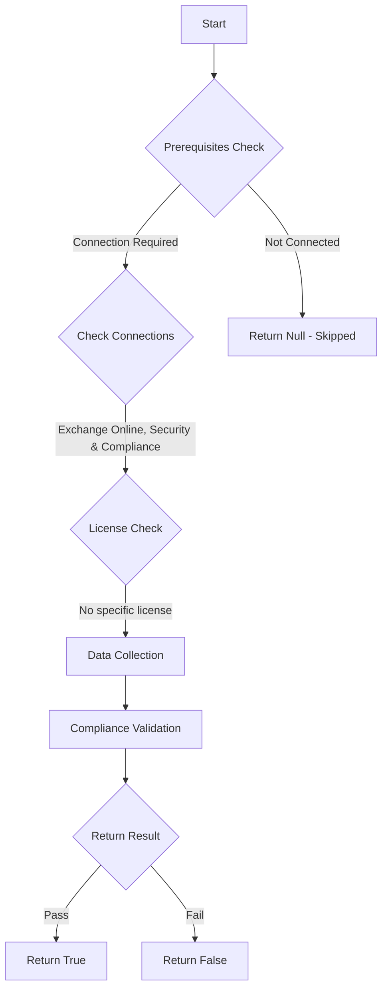

# ORCA: DKIM signing is set up for all your custom domains.

## Overview

**Function Name:** `Test-ORCA108`
**Category:** ORCA
**Test Tag:** `ORCA`

## Description

Generated on 08/10/2025 15:41:31 by .\build\orca\Update-OrcaTests.ps1

## Workflow

## Phase Details

### Phase 1: Prerequisites Check

**Required Connections:**
- Exchange Online
- Security & Compliance

### Phase 2: Data Collection

**Cmdlets/Functions Used:**
- `Get-ORCACollection`

### Phase 3: Compliance Validation

The function validates the collected data against compliance requirements.

### Phase 4: Return Result

| Return Value | Meaning |
| --- | --- |
| `$true` | Compliant |
| `$false` | Non-Compliant |
| `$null` | Skipped (missing prerequisites, license, or error) |

## Original Documentation

DKIM signing can help protect the authenticity of your messages in transit and can assist with deliverability of your email messages.

#### Remediation action
Set up DKIM signing to sign your emails.

#### Related Links

* [Microsoft 365 Defender Portal - DKIM](https://security.microsoft.com/authentication?viewid=DKIM) 
* [Use DKIM to validate outbound email sent from your custom domain in Office 365](https://aka.ms/orca-dkim-docs-1)

## Standalone Function

See the standalone compliance check function: [`Test-ORCA108Compliance.ps1`](../../standalone-functions/ORCA/Test-ORCA108Compliance.ps1)
