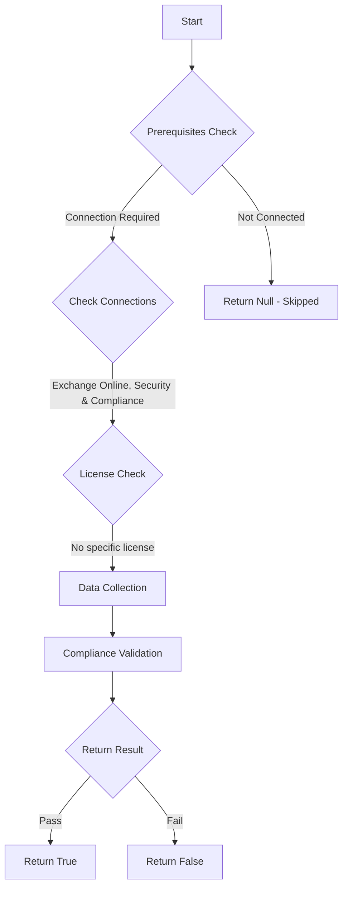

# ORCA: Senders are not being allow listed in an unsafe manner.

## Overview

**Function Name:** `Test-ORCA109`
**Category:** ORCA
**Test Tag:** `ORCA`

## Description

Generated on 08/10/2025 15:41:31 by .\build\orca\Update-OrcaTests.ps1

## Workflow

## Phase Details

### Phase 1: Prerequisites Check

**Required Connections:**
- Exchange Online
- Security & Compliance

### Phase 2: Data Collection

**Cmdlets/Functions Used:**
- `Get-ORCACollection`

### Phase 3: Compliance Validation

The function validates the collected data against compliance requirements.

### Phase 4: Return Result

| Return Value | Meaning |
| --- | --- |
| `$true` | Compliant |
| `$false` | Non-Compliant |
| `$null` | Skipped (missing prerequisites, license, or error) |

## Original Documentation

Emails coming from allow listed senders bypass several layers of protection within Exchange Online Protection. If senders are allow listed, they are open to being spoofed from malicious actors.

#### Remediation action
Remove allow listing on senders.

#### Related Links

* [Microsoft 365 Defender Portal - Anti-spam settings](https://security.microsoft.com/antispam) 
* [Recommended settings for EOP and Office 365 Microsoft Defender for Office 365 security](https://aka.ms/orca-atpp-docs-6) 
* [Use Anti-Spam Policy Sender/Domain Allow lists](https://aka.ms/orca-antispam-docs-4)

## Standalone Function

See the standalone compliance check function: [`Test-ORCA109Compliance.ps1`](../../standalone-functions/ORCA/Test-ORCA109Compliance.ps1)
