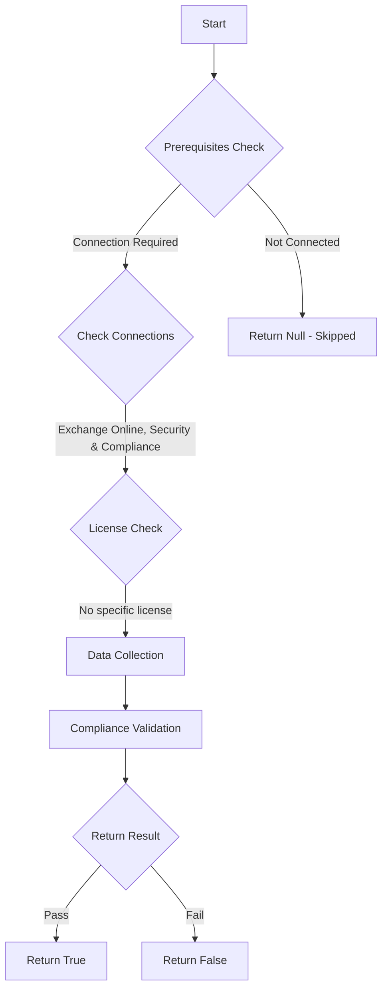

# ORCA: Anti-spoofing protection action is configured to Move message to the recipients' Junk Email folders in Anti-phishing policy.

## Overview

**Function Name:** `Test-ORCA112`
**Category:** ORCA
**Test Tag:** `ORCA`

## Description

Generated on 08/10/2025 15:41:31 by .\build\orca\Update-OrcaTests.ps1

## Workflow

## Phase Details

### Phase 1: Prerequisites Check

**Required Connections:**
- Exchange Online
- Security & Compliance

### Phase 2: Data Collection

**Cmdlets/Functions Used:**
- `Get-ORCACollection`

### Phase 3: Compliance Validation

The function validates the collected data against compliance requirements.

### Phase 4: Return Result

| Return Value | Meaning |
| --- | --- |
| `$true` | Compliant |
| `$false` | Non-Compliant |
| `$null` | Skipped (missing prerequisites, license, or error) |

## Original Documentation

When the sender email address is spoofed, the message appears to originate from someone or somewhere other than the actual source. With Standard security settings it is recommended to configure Anti-spoofing protection action to Move message to the recipients' Junk Email folders in Office 365 Anti-phishing policies.

#### Remediation action
Configure Anti-spoofing protection action to Move message to the recipients' Junk Email folders in Anti-phishing policy.

#### Related Links

* [Configuring the anti-spoofing policy](https://aka.ms/orca-atpp-docs-5) 
* [Microsoft 365 Defender Portal - Anti-phishing](https://security.microsoft.com/antiphishing) 
* [Recommended settings for EOP and Office 365 Microsoft Defender for Office 365 security](https://aka.ms/orca-atpp-docs-6)

## Standalone Function

See the standalone compliance check function: [`Test-ORCA112Compliance.ps1`](../../standalone-functions/ORCA/Test-ORCA112Compliance.ps1)
