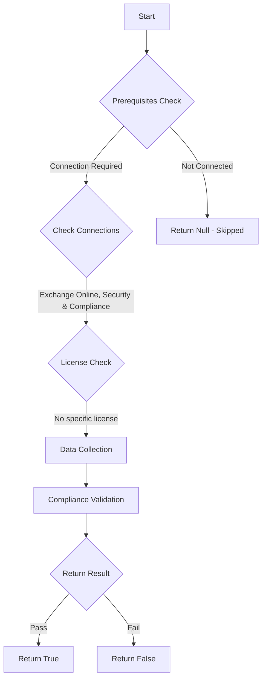

# ORCA: AllowClickThrough is disabled in Safe Links policies.

## Overview

**Function Name:** `Test-ORCA113`
**Category:** ORCA
**Test Tag:** `ORCA`

## Description

Generated on 08/10/2025 15:41:31 by .\build\orca\Update-OrcaTests.ps1

## Workflow

## Phase Details

### Phase 1: Prerequisites Check

**Required Connections:**
- Exchange Online
- Security & Compliance

### Phase 2: Data Collection

**Cmdlets/Functions Used:**
- `Get-ORCACollection`

### Phase 3: Compliance Validation

The function validates the collected data against compliance requirements.

### Phase 4: Return Result

| Return Value | Meaning |
| --- | --- |
| `$true` | Compliant |
| `$false` | Non-Compliant |
| `$null` | Skipped (missing prerequisites, license, or error) |

## Original Documentation

Microsoft Defender for Office 365 Safe Links can help protect your organization by providing time-of-click verification of  web addresses (URLs) in email messages and Office documents. It is possible to allow users click through Safe Links to the original URL. It is recommended to configure Safe Links policies to not let users click through safe links. 

#### Remediation action
Do not let users click through safe links to original URL.

#### Related Links

* [Microsoft 365 Defender Portal - Safe links](https://security.microsoft.com/safelinksv2) 
* [Microsoft Defender for Office 365 Safe Links policies](https://aka.ms/orca-atpp-docs-11) 
* [Recommended settings for EOP and Office 365 Microsoft Defender for Office 365 security](https://aka.ms/orca-atpp-docs-8)

## Standalone Function

See the standalone compliance check function: [`Test-ORCA113Compliance.ps1`](../../standalone-functions/ORCA/Test-ORCA113Compliance.ps1)
