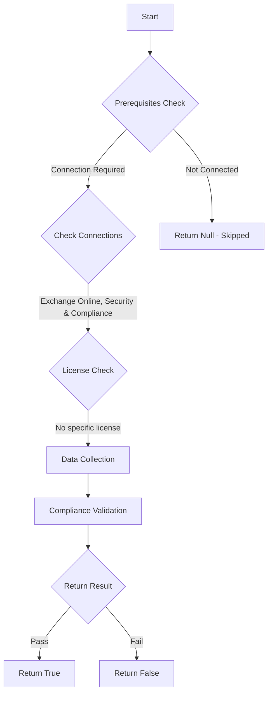

# ORCA: Your own domains are not being allow listed in an unsafe manner in Transport Rules.

## Overview

**Function Name:** `Test-ORCA118_4`
**Category:** ORCA
**Test Tag:** `ORCA`

## Description

Generated on 08/10/2025 15:41:31 by .\build\orca\Update-OrcaTests.ps1

## Workflow

## Phase Details

### Phase 1: Prerequisites Check

**Required Connections:**
- Exchange Online
- Security & Compliance

### Phase 2: Data Collection

**Cmdlets/Functions Used:**
- `Get-ORCACollection`

### Phase 3: Compliance Validation

The function validates the collected data against compliance requirements.

### Phase 4: Return Result

| Return Value | Meaning |
| --- | --- |
| `$true` | Compliant |
| `$false` | Non-Compliant |
| `$null` | Skipped (missing prerequisites, license, or error) |

## Original Documentation

Emails coming from allow listed domains bypass several layers of protection within Exchange Online Protection. When allow listing your own domains, an attacker can spoof any account in your organisation that has this domain. This is a significant phishing attack vector.

#### Remediation action
Remove allow listing on domains belonging to your organisation.

#### Related Links

* [Exchange admin center in Exchange Online](https://outlook.office365.com/ecp/) 
* [Using Exchange Transport Rules (ETRs) to allow specific senders](https://docs.microsoft.com/en-us/microsoft-365/security/office-365-security/create-safe-sender-lists-in-office-365#using-exchange-transport-rules-etrs-to-allow-specific-senders-recommended)

## Standalone Function

See the standalone compliance check function: [`Test-ORCA118_4Compliance.ps1`](../../standalone-functions/ORCA/Test-ORCA118_4Compliance.ps1)
