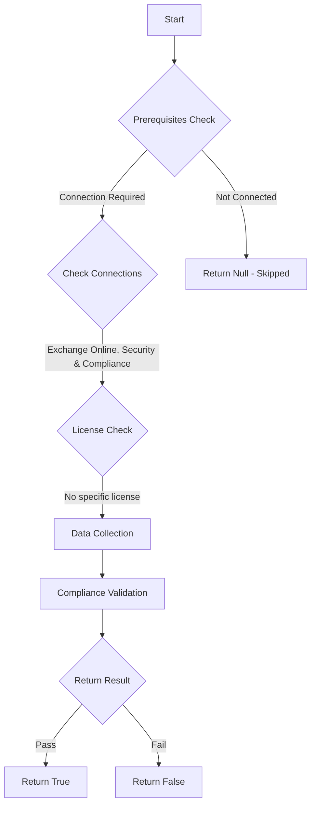

# ORCA: Safe Links Policies are tracking when user clicks on safe links.

## Overview

**Function Name:** `Test-ORCA156`
**Category:** ORCA
**Test Tag:** `ORCA`

## Description

Generated on 08/10/2025 15:41:32 by .\build\orca\Update-OrcaTests.ps1

## Workflow

## Phase Details

### Phase 1: Prerequisites Check

**Required Connections:**
- Exchange Online
- Security & Compliance

### Phase 2: Data Collection

**Cmdlets/Functions Used:**
- `Get-ORCACollection`

### Phase 3: Compliance Validation

The function validates the collected data against compliance requirements.

### Phase 4: Return Result

| Return Value | Meaning |
| --- | --- |
| `$true` | Compliant |
| `$false` | Non-Compliant |
| `$null` | Skipped (missing prerequisites, license, or error) |

## Original Documentation

When these options are configured, click data for URLs in Word, Excel, PowerPoint, Visio documents and in emails is stored by Safe Links. This information can help dealing with phishing, suspicious email messages and URLs.

#### Remediation action
Enable tracking of user clicks in Safe Links Policies.

#### Related Links

* [Microsoft 365 Defender Portal - Safe links](https://security.microsoft.com/safelinksv2) 
* [Recommended settings for EOP and Microsoft Defender for Office 365](https://aka.ms/orca-atpp-docs-7)

## Standalone Function

See the standalone compliance check function: [`Test-ORCA156Compliance.ps1`](../../standalone-functions/ORCA/Test-ORCA156Compliance.ps1)
