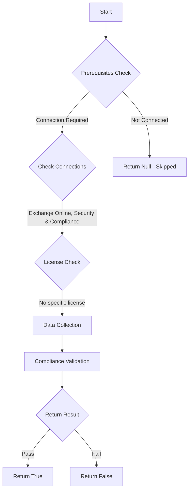

# ORCA: Safe Links is enabled intra-organization.

## Overview

**Function Name:** `Test-ORCA179`
**Category:** ORCA
**Test Tag:** `ORCA`

## Description

Generated on 08/10/2025 15:41:32 by .\build\orca\Update-OrcaTests.ps1

## Workflow

## Phase Details

### Phase 1: Prerequisites Check

**Required Connections:**
- Exchange Online
- Security & Compliance

### Phase 2: Data Collection

**Cmdlets/Functions Used:**
- `Get-ORCACollection`

### Phase 3: Compliance Validation

The function validates the collected data against compliance requirements.

### Phase 4: Return Result

| Return Value | Meaning |
| --- | --- |
| `$true` | Compliant |
| `$false` | Non-Compliant |
| `$null` | Skipped (missing prerequisites, license, or error) |

## Original Documentation

Phishing attacks are not limited from external users. Commonly, when one user is compromised, that user can be used in a process of lateral movement between different accounts in your organization. Configuring Safe Links so that internal messages are also re-written can assist with lateral movement using phishing. The built-in policy is ignored in this check, as it only provides the minimum level of protection.

#### Remediation action
Enable Safe Links between internal users.

#### Related Links

* [Microsoft 365 Defender Portal - Safe links](https://security.microsoft.com/safelinksv2) 
* [Recommended settings for EOP and Microsoft Defender for Office 365](https://aka.ms/orca-atpp-docs-7)

## Standalone Function

See the standalone compliance check function: [`Test-ORCA179Compliance.ps1`](../../standalone-functions/ORCA/Test-ORCA179Compliance.ps1)
