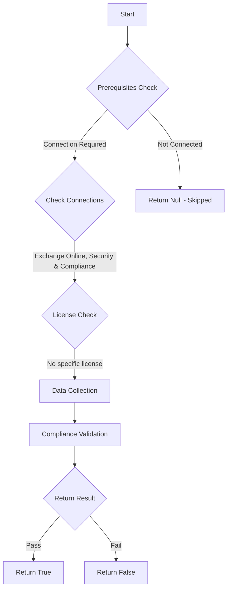

# ORCA: Safe Links is not bypassed.

## Overview

**Function Name:** `Test-ORCA189_2`
**Category:** ORCA
**Test Tag:** `ORCA`

## Description

Generated on 08/10/2025 15:41:32 by .\build\orca\Update-OrcaTests.ps1

## Workflow

## Phase Details

### Phase 1: Prerequisites Check

**Required Connections:**
- Exchange Online
- Security & Compliance

### Phase 2: Data Collection

**Cmdlets/Functions Used:**
- `Get-ORCACollection`

### Phase 3: Compliance Validation

The function validates the collected data against compliance requirements.

### Phase 4: Return Result

| Return Value | Meaning |
| --- | --- |
| `$true` | Compliant |
| `$false` | Non-Compliant |
| `$null` | Skipped (missing prerequisites, license, or error) |

## Original Documentation

Microsoft Defender for Office 365 Safe Links can help protect against phishing attacks by providing time-of-click verification of web addresses (URLs) in email messages and Office documents. The protection can be bypassed using mail flow rules which set the X-MS-Exchange-Organization-SkipSafeLinksProcessing header for email messages.

#### Remediation action
Remove mail flow rules which bypass Safe Links.

#### Related Links

* [Exchange admin center in Exchange Online](https://outlook.office365.com/ecp/)

## Standalone Function

See the standalone compliance check function: [`Test-ORCA189_2Compliance.ps1`](../../standalone-functions/ORCA/Test-ORCA189_2Compliance.ps1)
