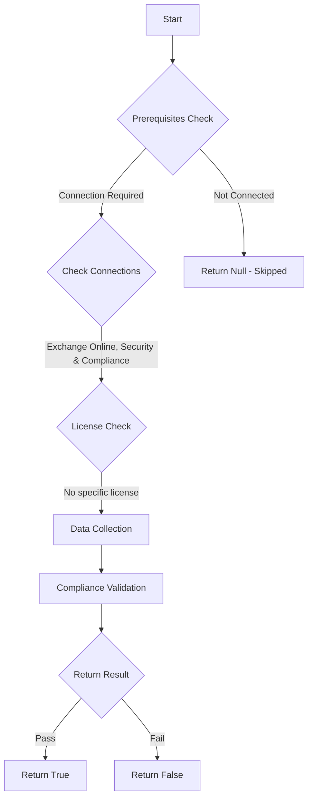

# ORCA: Common attachment type filter is enabled.

## Overview

**Function Name:** `Test-ORCA205`
**Category:** ORCA
**Test Tag:** `ORCA`

## Description

Generated on 08/10/2025 15:41:32 by .\build\orca\Update-OrcaTests.ps1

## Workflow

## Phase Details

### Phase 1: Prerequisites Check

**Required Connections:**
- Exchange Online
- Security & Compliance

### Phase 2: Data Collection

**Cmdlets/Functions Used:**
- `Get-ORCACollection`

### Phase 3: Compliance Validation

The function validates the collected data against compliance requirements.

### Phase 4: Return Result

| Return Value | Meaning |
| --- | --- |
| `$true` | Compliant |
| `$false` | Non-Compliant |
| `$null` | Skipped (missing prerequisites, license, or error) |

## Original Documentation

The common attachment type filter can block file types that commonly contain malware, including in internal emails.

#### Remediation action
Enable common attachment type filter.

#### Related Links

* [Configure anti-malware policies](https://aka.ms/orca-mfp-docs-1) 
* [Microsoft 365 Defender Portal - Anti-malware](https://security.microsoft.com/antimalwarev2) 
* [Recommended settings for EOP and Microsoft Defender for Office 365](https://aka.ms/orca-atpp-docs-6)

## Standalone Function

See the standalone compliance check function: [`Test-ORCA205Compliance.ps1`](../../standalone-functions/ORCA/Test-ORCA205Compliance.ps1)
