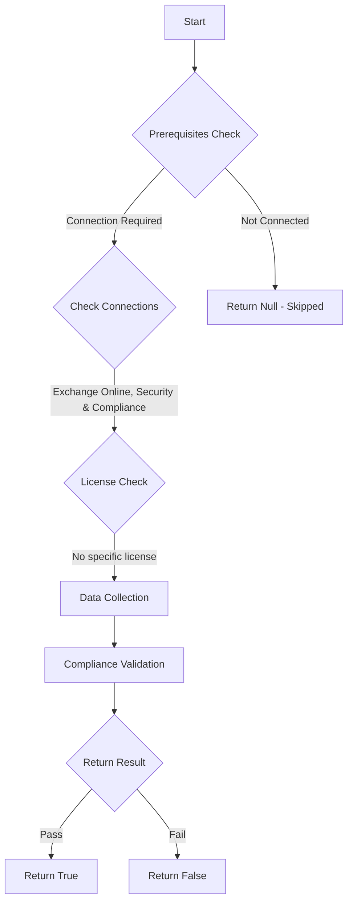

# ORCA: Each domain has a Safe Attachments policy applied to it.

## Overview

**Function Name:** `Test-ORCA227`
**Category:** ORCA
**Test Tag:** `ORCA`

## Description

Generated on 08/10/2025 15:41:32 by .\build\orca\Update-OrcaTests.ps1

## Workflow

## Phase Details

### Phase 1: Prerequisites Check

**Required Connections:**
- Exchange Online
- Security & Compliance

### Phase 2: Data Collection

**Cmdlets/Functions Used:**
- `Get-ORCACollection`

### Phase 3: Compliance Validation

The function validates the collected data against compliance requirements.

### Phase 4: Return Result

| Return Value | Meaning |
| --- | --- |
| `$true` | Compliant |
| `$false` | Non-Compliant |
| `$null` | Skipped (missing prerequisites, license, or error) |

## Original Documentation

Microsoft Defender for Office 365 Safe Attachments policies are applied using rules. The recipient domain condition is the most effective way of applying the Safe Attachments policy, ensuring no users are left without protection. If polices are applied using group membership make sure you cover all users through this method. Applying polices this way can be challenging, users may left unprotected if group memberships are not accurate and up to date. It is important not to rely on the 'built-in' Safe Links policy, as this policy only applies the minimum level of protections and should serve as a catch-all.

#### Remediation action
Apply a Safe Attachments policy to every domain.

#### Related Links

* [Microsoft 365 Defender Portal - Safe attachments](https://security.microsoft.com/safeattachmentv2) 
* [Order and precedence of email protection](https://aka.ms/orca-atpp-docs-4) 
* [Recommended settings for EOP and Microsoft Defender for Office 365](https://aka.ms/orca-atpp-docs-7)

## Standalone Function

See the standalone compliance check function: [`Test-ORCA227Compliance.ps1`](../../standalone-functions/ORCA/Test-ORCA227Compliance.ps1)
