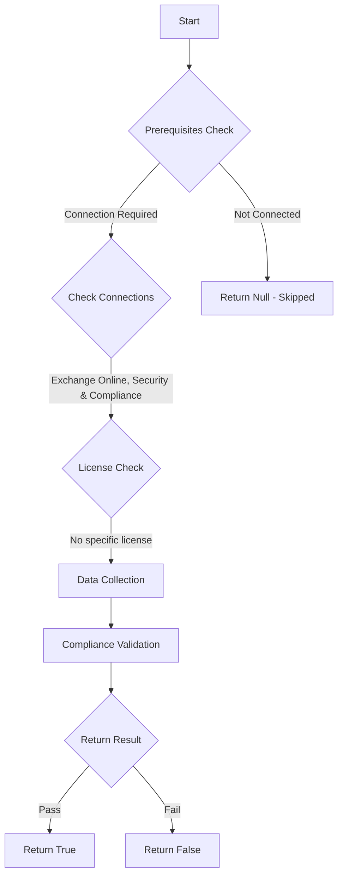

# ORCA: Each domain has a malware filter policy applied to it, or the default policy is being used.

## Overview

**Function Name:** `Test-ORCA232`
**Category:** ORCA
**Test Tag:** `ORCA`

## Description

Generated on 08/10/2025 15:41:32 by .\build\orca\Update-OrcaTests.ps1

## Workflow

## Phase Details

### Phase 1: Prerequisites Check

**Required Connections:**
- Exchange Online
- Security & Compliance

### Phase 2: Data Collection

**Cmdlets/Functions Used:**
- `Get-ORCACollection`

### Phase 3: Compliance Validation

The function validates the collected data against compliance requirements.

### Phase 4: Return Result

| Return Value | Meaning |
| --- | --- |
| `$true` | Compliant |
| `$false` | Non-Compliant |
| `$null` | Skipped (missing prerequisites, license, or error) |

## Original Documentation

Exchange Online Protection malware filter policies are applied using rules. The default policy applies in the absence of a custom policy. When creating custom policies, there may be duplication of settings and depending on the rules and priority, some policies or settings may not even apply. It's important in this circumstance to check that the desired settings are applied to the right users.

#### Remediation action
Check your malware filter policies for duplicate rules. Some policies and settings may not be applying.

#### Related Links

* [Microsoft 365 Defender Portal - Anti-malware policies](https://security.microsoft.com/antimalwarev2) 
* [Order and precedence of email protection](https://aka.ms/orca-atpp-docs-4)

## Standalone Function

See the standalone compliance check function: [`Test-ORCA232Compliance.ps1`](../../standalone-functions/ORCA/Test-ORCA232Compliance.ps1)
