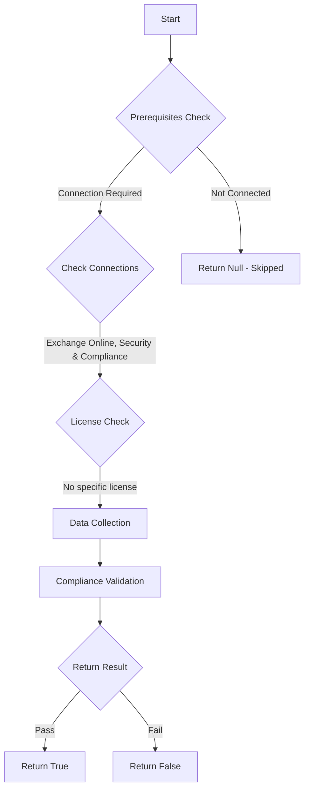

# ORCA: Domains are pointed directly at EOP or enhanced filtering is configured on all default connectors.

## Overview

**Function Name:** `Test-ORCA233_1`
**Category:** ORCA
**Test Tag:** `ORCA`

## Description

Generated on 08/10/2025 15:41:32 by .\build\orca\Update-OrcaTests.ps1

## Workflow

## Phase Details

### Phase 1: Prerequisites Check

**Required Connections:**
- Exchange Online
- Security & Compliance

### Phase 2: Data Collection

**Cmdlets/Functions Used:**
- `Get-ORCACollection`

### Phase 3: Compliance Validation

The function validates the collected data against compliance requirements.

### Phase 4: Return Result

| Return Value | Meaning |
| --- | --- |
| `$true` | Compliant |
| `$false` | Non-Compliant |
| `$null` | Skipped (missing prerequisites, license, or error) |

## Original Documentation

Exchange Online Protection (EOP) and Microsoft Defender for Office 365 works best when the mail exchange (MX) record is pointed directly at the service. In the event another third-party service is being used, a very important signal (the senders IP address) is obfuscated and hidden from EOP & MDO, generating a larger quantity of false positives and false negatives. By configuring Enhanced Filtering with the IP addresses of these services the true senders IP address can be discovered, reducing the false-positive and false-negative impact.

#### Remediation action
Configure enhanced filtering on connectors when email path is not direct to EOP.

#### Related Links

* [Enhanced Filtering for Connectors](https://aka.ms/orca-connectors-docs-1) 
* [Microsoft 365 Defender Portal - Enhanced Filtering](https://aka.ms/orca-connectors-action-skiplisting)

## Standalone Function

See the standalone compliance check function: [`Test-ORCA233_1Compliance.ps1`](../../standalone-functions/ORCA/Test-ORCA233_1Compliance.ps1)
