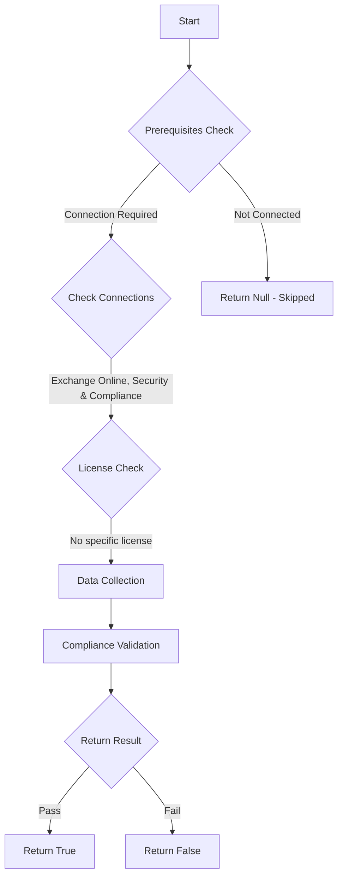

# ORCA: SPF records is set up for all your custom domains.

## Overview

**Function Name:** `Test-ORCA235`
**Category:** ORCA
**Test Tag:** `ORCA`

## Description

Generated on 08/10/2025 15:41:32 by .\build\orca\Update-OrcaTests.ps1

## Workflow

## Phase Details

### Phase 1: Prerequisites Check

**Required Connections:**
- Exchange Online
- Security & Compliance

### Phase 2: Data Collection

**Cmdlets/Functions Used:**
- `Get-ORCACollection`

### Phase 3: Compliance Validation

The function validates the collected data against compliance requirements.

### Phase 4: Return Result

| Return Value | Meaning |
| --- | --- |
| `$true` | Compliant |
| `$false` | Non-Compliant |
| `$null` | Skipped (missing prerequisites, license, or error) |

## Original Documentation

SPF helps validate outbound email sent from your custom domain. Microsoft 365 uses the Sender Policy Framework (SPF) TXT record in DNS to ensure that destination email systems trust messages sent from your custom domain.

#### Remediation action
Set up SPF records to prevent spoofing.

#### Related Links

* [Use SPF to validate outbound email sent from your custom domain in Office 365](https://aka.ms/orca-spf-docs-1)

## Standalone Function

See the standalone compliance check function: [`Test-ORCA235Compliance.ps1`](../../standalone-functions/ORCA/Test-ORCA235Compliance.ps1)
