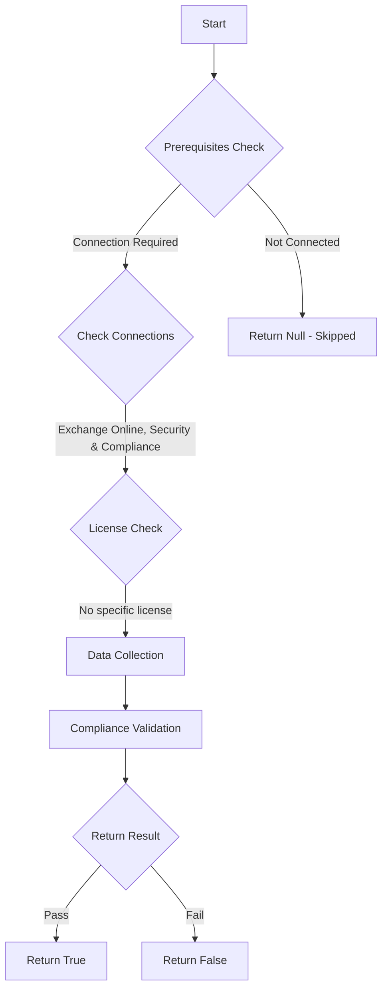

# ORCA: Outlook is configured to display external tags for external emails.

## Overview

**Function Name:** `Test-ORCA240`
**Category:** ORCA
**Test Tag:** `ORCA`

## Description

Generated on 08/10/2025 15:41:32 by .\build\orca\Update-OrcaTests.ps1

## Workflow

## Phase Details

### Phase 1: Prerequisites Check

**Required Connections:**
- Exchange Online
- Security & Compliance

### Phase 2: Data Collection

**Cmdlets/Functions Used:**
- `Get-ORCACollection`

### Phase 3: Compliance Validation

The function validates the collected data against compliance requirements.

### Phase 4: Return Result

| Return Value | Meaning |
| --- | --- |
| `$true` | Compliant |
| `$false` | Non-Compliant |
| `$null` | Skipped (missing prerequisites, license, or error) |

## Original Documentation

External tags show users email that is coming from external. EOP & MDO works with native client side integration to clearly highlight external emails. This allows you to train users to identify these emails so that they can be more suspicious about the email contents.

#### Remediation action
Configure external tags to highlight emails which are sent from external.

#### Related Links

* [Native external in Outlook](https://techcommunity.microsoft.com/t5/exchange-team-blog/native-external-sender-callouts-on-email-in-outlook/ba-p/2250098) 
* [Set External in Outlook (Set-ExternalInOutlook)](https://learn.microsoft.com/en-us/powershell/module/exchange/set-externalinoutlook?view=exchange-ps)

## Standalone Function

See the standalone compliance check function: [`Test-ORCA240Compliance.ps1`](../../standalone-functions/ORCA/Test-ORCA240Compliance.ps1)
