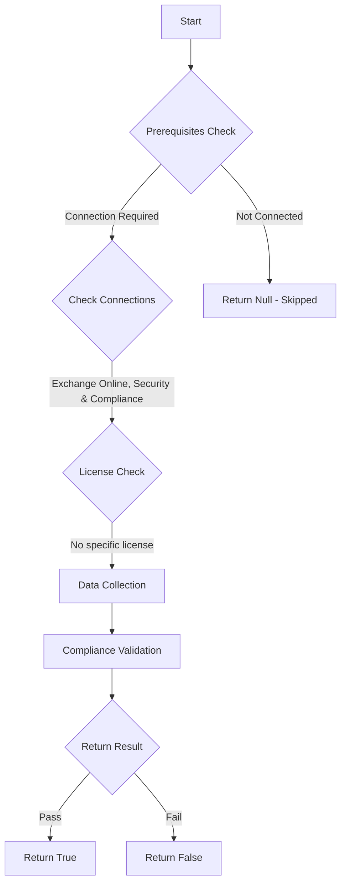

# ORCA: Anti-phishing policy exists and EnableFirstContactSafetyTips is true.

## Overview

**Function Name:** `Test-ORCA241`
**Category:** ORCA
**Test Tag:** `ORCA`

## Description

Generated on 08/10/2025 15:41:32 by .\build\orca\Update-OrcaTests.ps1

## Workflow

## Phase Details

### Phase 1: Prerequisites Check

**Required Connections:**
- Exchange Online
- Security & Compliance

### Phase 2: Data Collection

**Cmdlets/Functions Used:**
- `Get-ORCACollection`

### Phase 3: Compliance Validation

The function validates the collected data against compliance requirements.

### Phase 4: Return Result

| Return Value | Meaning |
| --- | --- |
| `$true` | Compliant |
| `$false` | Non-Compliant |
| `$null` | Skipped (missing prerequisites, license, or error) |

## Original Documentation

Attackers pretend to be other people in order to trick users. By enabling first contact safety tips, users are shown a visual representation on the email that this is the first time that they have received an email from this sender. This can trigger users in to being suspicious of an email if it they believe it is coming from someone they know.

#### Remediation action
Enable first contact safety tips to highlight suspicious messages to users.

#### Related Links

* [First Contact Safety Tip](https://learn.microsoft.com/en-us/microsoft-365/security/office-365-security/anti-phishing-policies-about?view=o365-worldwide#first-contact-safety-tip) 
* [Microsoft 365 Defender Portal - Anti-phishing](https://security.microsoft.com/antiphishing)

## Standalone Function

See the standalone compliance check function: [`Test-ORCA241Compliance.ps1`](../../standalone-functions/ORCA/Test-ORCA241Compliance.ps1)
