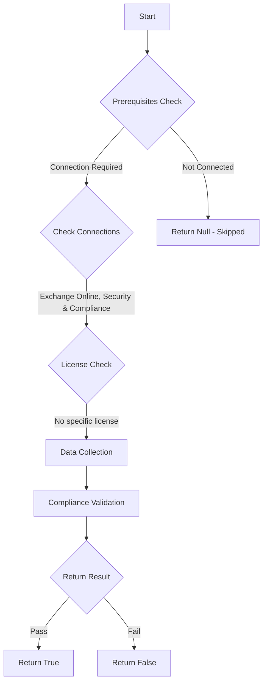

# ORCA: Important protection alerts responsible for AIR activities are enabled.

## Overview

**Function Name:** `Test-ORCA242`
**Category:** ORCA
**Test Tag:** `ORCA`

## Description

Generated on 08/10/2025 15:41:32 by .\build\orca\Update-OrcaTests.ps1

## Workflow

## Phase Details

### Phase 1: Prerequisites Check

**Required Connections:**
- Exchange Online
- Security & Compliance

### Phase 2: Data Collection

**Cmdlets/Functions Used:**
- `Get-ORCACollection`

### Phase 3: Compliance Validation

The function validates the collected data against compliance requirements.

### Phase 4: Return Result

| Return Value | Meaning |
| --- | --- |
| `$true` | Compliant |
| `$false` | Non-Compliant |
| `$null` | Skipped (missing prerequisites, license, or error) |

## Original Documentation

Automated Incident Response (AIR) triggers off certain alerts that fire in the environment. AIR is responsible for detecting further anomalies and providing automated remediation actions designed to mitigate threats/attacks. It is important that these alerts are enabled so that AIR can function correctly.

#### Remediation action
Enable important protection alerts that are responsible for AIR activities.

#### Related Links

* [Automated investigation and response in Microsoft 365 Defender](https://learn.microsoft.com/en-us/microsoft-365/security/defender/m365d-autoir)

## Standalone Function

See the standalone compliance check function: [`Test-ORCA242Compliance.ps1`](../../standalone-functions/ORCA/Test-ORCA242Compliance.ps1)
