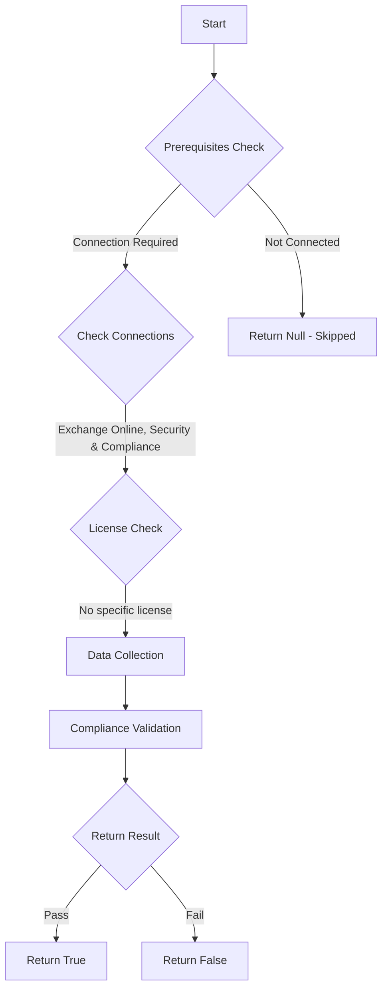

# ORCA: Authenticated Receive Chain is set up for domains not pointing to EOP/MDO, or all domains point to EOP/MDO.

## Overview

**Function Name:** `Test-ORCA243`
**Category:** ORCA
**Test Tag:** `ORCA`

## Description

Generated on 08/10/2025 15:41:32 by .\build\orca\Update-OrcaTests.ps1

## Workflow

## Phase Details

### Phase 1: Prerequisites Check

**Required Connections:**
- Exchange Online
- Security & Compliance

### Phase 2: Data Collection

**Cmdlets/Functions Used:**
- `Get-ORCACollection`

### Phase 3: Compliance Validation

The function validates the collected data against compliance requirements.

### Phase 4: Return Result

| Return Value | Meaning |
| --- | --- |
| `$true` | Compliant |
| `$false` | Non-Compliant |
| `$null` | Skipped (missing prerequisites, license, or error) |

## Original Documentation

When EOP/MDO is behind a third-party service, sender authentication checks such as DKIM & SPF can fail. This is due to the fact that the service infront may modify the message and break the signature, or send from an IP address that is not a registered sender for the domain. By configuring the third-party to ARC seal the message, and setting up a trusted ARC sealer, the authentication results of the third-party mail relay can be used. IMPORTANT NOTE: This check cannot validate that the third-party service infront of these domains is correctly ARC sealing your emails, nor can it check that the domain portion matches one of the trusted ARC sealers. This check purely validates a trusted ARC sealer exists. Even if this check passes, you should validate your emails are passing ARC seal

#### Remediation action
Enable Authenticated Receive Chain (ARC) trusted sealers for domains not pointed at EOP/MDO.

#### Related Links

* [Configuring trusted ARC sealers](https://learn.microsoft.com/en-us/microsoft-365/security/office-365-security/email-authentication-arc-configure?view=o365-worldwide) 
* [Improving 'Defense in Depth' with Trusted ARC Sealers for Microsoft Defender for Office 365](https://techcommunity.microsoft.com/t5/microsoft-defender-for-office/improving-defense-in-depth-with-trusted-arc-sealers-for/ba-p/3440707)

## Standalone Function

See the standalone compliance check function: [`Test-ORCA243Compliance.ps1`](../../standalone-functions/ORCA/Test-ORCA243Compliance.ps1)
