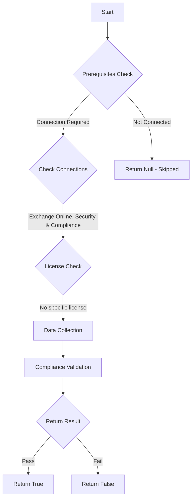

# ORCA: Policies are configured to honor sending domains DMARC.

## Overview

**Function Name:** `Test-ORCA244`
**Category:** ORCA
**Test Tag:** `ORCA`

## Description

Generated on 08/10/2025 15:41:32 by .\build\orca\Update-OrcaTests.ps1

## Workflow

## Phase Details

### Phase 1: Prerequisites Check

**Required Connections:**
- Exchange Online
- Security & Compliance

### Phase 2: Data Collection

**Cmdlets/Functions Used:**
- `Get-ORCACollection`

### Phase 3: Compliance Validation

The function validates the collected data against compliance requirements.

### Phase 4: Return Result

| Return Value | Meaning |
| --- | --- |
| `$true` | Compliant |
| `$false` | Non-Compliant |
| `$null` | Skipped (missing prerequisites, license, or error) |

## Original Documentation

Domain-based Message Authentication, Reporting & Conformance (DMARC) is a standard that helps prevent spoofing by verifying the senders identity. If an email fails DMARC validation, it often means that the sender is not who they claim to be, and the email could be fraudulent. The owner of the sending domain controls the DMARC policy for their domain, and provides recommendations to receivers on what action should be performed when DMARC fails. When the Honor DMARC Policy setting is set to False, the organisations policy is not considered. It is recommended to honor this policy. 

#### Remediation action
Configure anti-phish policy to honor sending domains DMARC configuration.

#### Related Links

* [Announcing New DMARC Policy Handling Defaults for Enhanced Email Security](https://techcommunity.microsoft.com/t5/exchange-team-blog/announcing-new-dmarc-policy-handling-defaults-for-enhanced-email/ba-p/3878883) 
* [Microsoft 365 Defender Portal - Anti-phishing](https://security.microsoft.com/antiphishing)

## Standalone Function

See the standalone compliance check function: [`Test-ORCA244Compliance.ps1`](../../standalone-functions/ORCA/Test-ORCA244Compliance.ps1)
