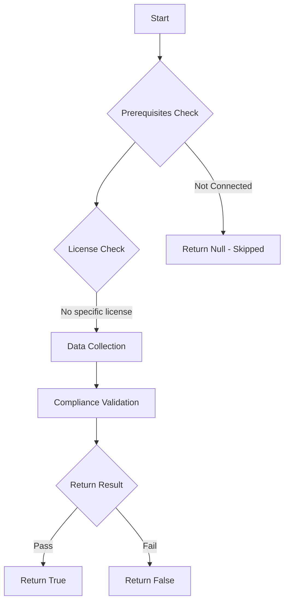

# Test-MtXspmAppRegWithPrivilegedRolesAndOwners: Tests if app registration owners with highly privileged Entra ID roles have delegated ownership.

## Overview

**Function Name:** `Test-MtXspmAppRegWithPrivilegedRolesAndOwners`
**Category:** XSPM

## Description

This function checks all Entra ID app registrations with highly privileged Entra ID roles and checks if ownership has been delegated.

## Workflow

## Phase Details

### Phase 1: Prerequisites Check

No specific prerequisites required.

### Phase 2: Data Collection

**Cmdlets/Functions Used:**
- `Get-MtXspmUnifiedIdentityInfo`
- `Get-MtXspmPrivilegedClassificationIcon`

### Phase 3: Compliance Validation

**Properties Checked:**

| Property | Expected Value |
| --- | --- |
| `Type` | `Workload` |
| `Classification` | `ControlPlane` |
| `Classification` | `ManagementPlane` |
| `RoleIsPrivileged` | `$True` |
| `type` | `AadObjectId` |
| `AccountObjectId` | `$MatchedObjectId` |
| `RoleScope` | `$RoleScope` |

### Phase 4: Return Result

| Return Value | Meaning |
| --- | --- |
| `$true` | Compliant |
| `$false` | Non-Compliant |
| `$null` | Skipped (missing prerequisites, license, or error) |

## Original Documentation

Owners with lower privilege than the application should be removed from ownership.
Microsoft also mentions this [risk of elevation of privilege](https://learn.microsoft.com/en-us/entra/identity/enterprise-apps/overview-assign-app-owners) over what the owner has access to as a user.
Those delegations can be identified by the `Tier breach` flag in the test results.

But even owners with the same or higher privilege should not be delegated ownership because of missing support for just-in-time access (eligibility in PIM), enforced step-up authentication (authentication context by PIM in Entra ID roles), or assignment via group membership.

_Side Note: Currently, due to limitations of XSPM data, only assignments on application objects are identified._

### How to fix
Remove ownership and replace it (if necessary) by using [object-level role assignments](https://learn.microsoft.com/en-us/entra/identity/role-based-access-control/manage-roles-portal?tabs=admin-center#assign-roles-with-app-registration-scope), and avoid any lateral movement paths by delegating to administrators with lower privilege classification (tier breach).

<!--- Results --->
%TestResult%

## Standalone Function

See the standalone compliance check function: [`Test-MtXspmAppRegWithPrivilegedRolesAndOwnersCompliance.ps1`](../../standalone-functions/XSPM/Test-MtXspmAppRegWithPrivilegedRolesAndOwnersCompliance.ps1)
