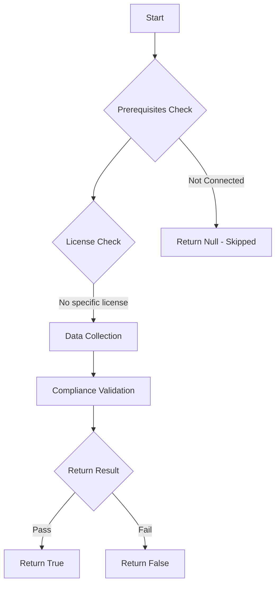

# Test-MtXspmAppRegWithPrivilegedUnusedPermissions: Tests if app registration have assigned privileged API permissions which are unused.

## Overview

**Function Name:** `Test-MtXspmAppRegWithPrivilegedUnusedPermissions`
**Category:** XSPM

## Description

This function checks all Entra ID app registrations with privileged API permissions and checks if any of them are unused.

## Workflow

## Phase Details

### Phase 1: Prerequisites Check

No specific prerequisites required.

### Phase 2: Data Collection

**Cmdlets/Functions Used:**
- `Get-MtXspmUnifiedIdentityInfo`
- `Get-MtXspmPrivilegedClassificationIcon`

### Phase 3: Compliance Validation

**Properties Checked:**

| Property | Expected Value |
| --- | --- |
| `Classification` | `ControlPlane` |
| `Classification` | `ManagementPlane` |
| `PrivilegeLevel` | `High` |
| `InUse` | `$false` |

### Phase 4: Return Result

| Return Value | Meaning |
| --- | --- |
| `$true` | Compliant |
| `$false` | Non-Compliant |
| `$null` | Skipped (missing prerequisites, license, or error) |

## Original Documentation

Unused privileged permissions should not remain assigned to a service principal because they increase the attack surface and risk of unauthorized access. If these permissions are not required for the application's functionality, they can be exploited by attackers or misused, leading to potential privilege escalation or data exposure. Removing unnecessary privileged permissions helps maintain a stronger security posture and reduces the likelihood of security incidents.

### How to fix
Review the findings in the [Applications inventory](https://learn.microsoft.com/en-us/defender-cloud-apps/applications-inventory#oauth-apps) in App Governance, and verify that there are no activities or use cases requiring the affected service principal to have assignments to these API permissions. Use [hunting of app activities](https://learn.microsoft.com/en-us/defender-cloud-apps/app-activity-threat-hunting) to review access and required permissions.

<!--- Results --->
%TestResult%

## Standalone Function

See the standalone compliance check function: [`Test-MtXspmAppRegWithPrivilegedUnusedPermissionsCompliance.ps1`](../../standalone-functions/XSPM/Test-MtXspmAppRegWithPrivilegedUnusedPermissionsCompliance.ps1)
