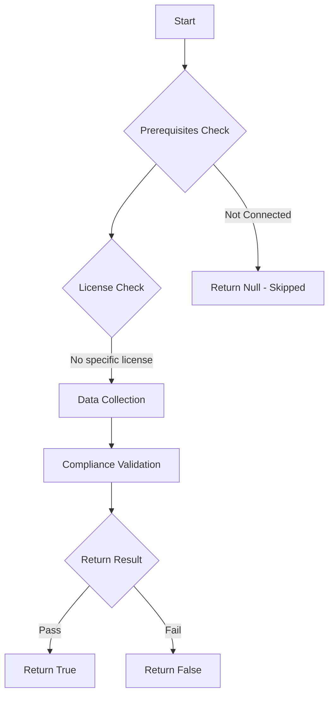

# Test-MtXspmCriticalCredentialsOnNonCredGuardProtectedDevices: Find devices with critical credentials stored on devices not protected by Credential Guard.

## Overview

**Function Name:** `Test-MtXspmCriticalCredentialsOnNonCredGuardProtectedDevices`
**Category:** XSPM

## Description

Find devices with critical credentials stored on devices not protected by Credential Guard.

## Workflow

## Phase Details

### Phase 1: Prerequisites Check

No specific prerequisites required.

### Phase 2: Data Collection

**Cmdlets/Functions Used:**
- `Invoke-MtGraphSecurityQuery`

### Phase 3: Compliance Validation

The function validates the collected data against compliance requirements.

### Phase 4: Return Result

| Return Value | Meaning |
| --- | --- |
| `$true` | Compliant |
| `$false` | Non-Compliant |
| `$null` | Skipped (missing prerequisites, license, or error) |

## Original Documentation

Devices shown in the output are devices where Credential Guard is not enabled or misconfigured, but contains credentials of critical accounts. When critical credentials are stored on devices without Credential Guard enabled, it is easy for adversaries to steal those credentials when the device is compromised. This is because, without Credential Guard enabled, Kerberos, NTLM, and Credential Manager secrets are stored in the Local Security Authority (LSA) process called `lsass.exe`, which can be dumped with various tools like MimiKatz. With Credential Guard enabled, these secrets are protected and isolated using Virtualization-based security (VBS).

### How to fix
Investigate the related devices and the steps that need to be taken in order to enable Credential Guard. This varies depending on operating system, hardware, and device. More information on how Credential Guard works and how it can be configured can be found in [this documentation page](https://learn.microsoft.com/en-us/windows/security/identity-protection/credential-guard/).

<!--- Results --->
%TestResult%

## Standalone Function

See the standalone compliance check function: [`Test-MtXspmCriticalCredentialsOnNonCredGuardProtectedDevicesCompliance.ps1`](../../standalone-functions/XSPM/Test-MtXspmCriticalCredentialsOnNonCredGuardProtectedDevicesCompliance.ps1)
