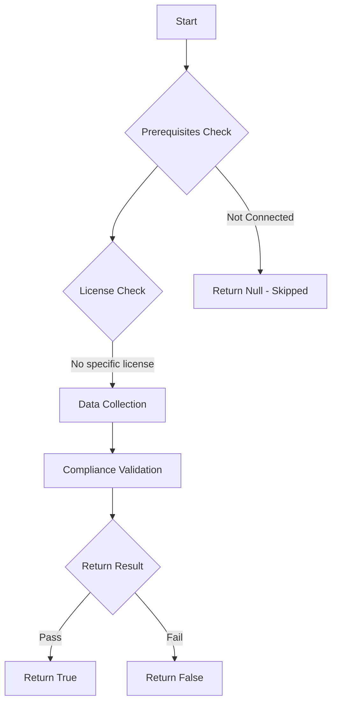

# Test-MtXspmCriticalCredentialsOnNonTpmProtectedDevices: Test to find devices that have critical credentials stored on devices that are not protected by TPM.

## Overview

**Function Name:** `Test-MtXspmCriticalCredentialsOnNonTpmProtectedDevices`
**Category:** XSPM

## Description

Test to find devices that have critical credentials stored on devices that are not protected by TPM.

## Workflow

## Phase Details

### Phase 1: Prerequisites Check

No specific prerequisites required.

### Phase 2: Data Collection

**Cmdlets/Functions Used:**
- `Invoke-MtGraphSecurityQuery`

### Phase 3: Compliance Validation

The function validates the collected data against compliance requirements.

### Phase 4: Return Result

| Return Value | Meaning |
| --- | --- |
| `$true` | Compliant |
| `$false` | Non-Compliant |
| `$null` | Skipped (missing prerequisites, license, or error) |

## Original Documentation

Devices shown in the output are devices where a TPM (Trusted Platform Module) is not enabled, but contains credentials of critical accounts. When critical credentials are stored on devices without a TPM enabled, it is more easy for adversaries to steal those credentials when the device is compromised.

### How to fix
Investigate the related devices and the steps that need to be taken in order to enable TPM support. This varies depending on operating system, hardware, and device. For more detailed results, you can [manually run the following query in advanced hunting](https://github.com/HybridBrothers/Hunting-Queries-Detection-Rules/blob/main/Exposure%20Management/HuntCriticalCredentialsOnNonTpmDevices.md).

<!--- Results --->
%TestResult%

## Standalone Function

See the standalone compliance check function: [`Test-MtXspmCriticalCredentialsOnNonTpmProtectedDevicesCompliance.ps1`](../../standalone-functions/XSPM/Test-MtXspmCriticalCredentialsOnNonTpmProtectedDevicesCompliance.ps1)
