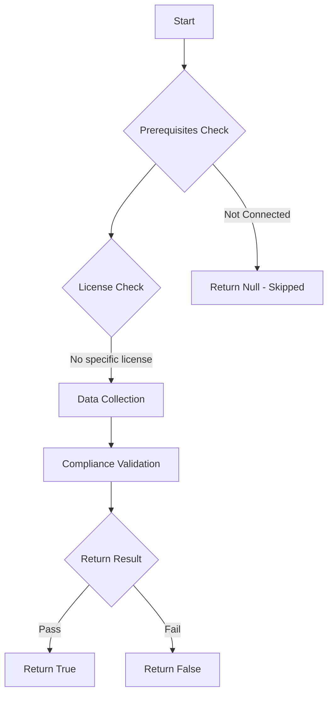

# Test-MtXspmCriticalCredsOnDevicesWithNonCriticalAccounts: Test to find devices with critical and non-critical user credentials on the same device

## Overview

**Function Name:** `Test-MtXspmCriticalCredsOnDevicesWithNonCriticalAccounts`
**Category:** XSPM

## Description

Test to find devices with critical and non-critical user credentials on the same device

## Workflow

## Phase Details

### Phase 1: Prerequisites Check

No specific prerequisites required.

### Phase 2: Data Collection

**Cmdlets/Functions Used:**
- `Invoke-MtGraphSecurityQuery`

### Phase 3: Compliance Validation

The function validates the collected data against compliance requirements.

### Phase 4: Return Result

| Return Value | Meaning |
| --- | --- |
| `$true` | Compliant |
| `$false` | Non-Compliant |
| `$null` | Skipped (missing prerequisites, license, or error) |

## Original Documentation

Normal user account (or non-critical user account) credentials should not live on devices that also have credentials of critical users. This makes the related devices an interesting target for attackers to exploit to eventually perform privilege escalation and lateral movement.

### How to fix

Analyze the devices shown in the output, and investigate the accounts present on the device. If the device is a client device, make sure Admin accounts get their own specific device (like a PAW) to ensure it cannot be abused by exploiting the normal user account. For servers, make sure to implement a tiering architecture forcing accounts to only login into servers of their shared tier.

<!--- Results --->
%TestResult%

## Standalone Function

See the standalone compliance check function: [`Test-MtXspmCriticalCredsOnDevicesWithNonCriticalAccountsCompliance.ps1`](../../standalone-functions/XSPM/Test-MtXspmCriticalCredsOnDevicesWithNonCriticalAccountsCompliance.ps1)
